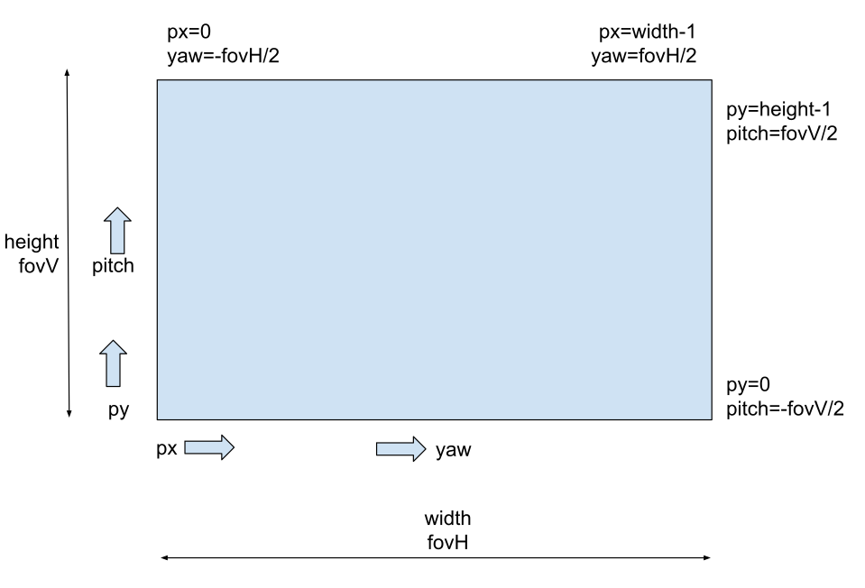

# Integration API Sonar 3D-15

## Introduction
The **Water Linked Sonar 3D-15** provides real-time 3D views of underwater environments using a low-bandwidth **Range Image Protocol (RIP1)**. This protocol efficiently transmits data such as 3D points or grayscale bitmaps over UDP (multicast or unicast), enabling live visualization, analysis, or archival for later use.

<!-- Typical output modes:

1. **Strength Image** – 2D, first-person view with color/brightness indicating reflection strength.  
2. **Range Image** – 2D, first-person view with color/brightness indicating distance.  
3. **Point Cloud** – 3D visualization for detailed analysis, derived from the same range data. -->

---

## Range Image Protocol (RIP1)
RIP1 is a compact format for range and bitmap images, designed for <10 Mbit bandwidth. Each packet:

- Fits within a single UDP packet (max 65,507 bytes).
- Starts with the 4-byte ID `"RIP1"`.
- Contains a length field, a serialized Protobuf payload, and a CRC-32.

**Decoding Steps**:

1. Verify the `RIP1` ID.  
2. Check the packet length and CRC-32.  
3. Decode into `waterlinked.rip1.Packet`.  
4. Use `.type_url` to identify the contained message.  
5. Decode `.value` into that message type.  
6. Interpret fields per the `.proto` [File](#proto-file-excerpt).

---

## Coordinate and Image Conventions
**Axes** (right-handed):

- **x**: forward  
- **y**: right  
- **z**: downward  

**Image**:



- Horizontal FOV (`fovH`) spans width.
- Vertical FOV (`fovV`) spans height.
- `(px, py)` maps to `(yaw, pitch)`:
  ```python
  yaw = (px / (width - 1))  * fovH - (fovH / 2)
  pitch = (py / (height - 1)) * fovV - (fovV / 2)
  ```

**Example: Converting Range Image to 3D**:
```cpp
// Convert pixelValue to radius in meters
if (pixelValue == 0) {
  return Undefined; // no valid data
}
radius = pixelValue * imagePixelScale;

// Convert (yaw, pitch) from degrees to radians
yaw   = deg2rad((px / (width - 1))  * fovH - (fovH / 2));
pitch = deg2rad((py / (height - 1)) * fovV - (fovV / 2));

// Cartesian conversion (x forward, y right, z down)
x = radius * cos(pitch) * cos(yaw);
y = radius * cos(pitch) * sin(yaw);
z = -radius * sin(pitch); // z is downward
```

---

## Message Types
RIP1 supports several Protobuf-encoded messages, including:

### `BitmapImageGreyscale8`
- 8-bit grayscale; each pixel = signal strength or shaded depth.  
- `type` enum differentiates **signal strength** vs. **shaded**.  

### `RangeImage`
- Each pixel represents distance (radius) to the strongest reflection.
- `0` = no valid data.
- `radius = pixelValue * imagePixelScale`.

---

## Network
By default, the Sonar 3D-15 uses **UDP Multicast** (`224.0.0.96:4747`), so any device on the local network can receive data without knowing the sonar’s IP. You can also configure **UDP Unicast** to send data to a specific IP/port, allowing routing outside the local network (but losing multicast discoverability).

---

## Image Sizes and Update Rates
| **Mode**      | **Resolution (W×H)** | **FOV (H×V)** | **Rate** |
|---------------|----------------------|--------------|---------|
| Navigation    | 256 × 64            | 90° × 40°     | 5 Hz    |
| Inspection    | 256 × 64            | 40° × 40°     | 20 Hz   |

---

## Example Data
Typical example data may include:

- **Range** and **Strength** images from different positions.
- **IMU** data (pitch, roll, yaw).
- Python sample code for decoding and visualizing range images with Matplotlib.

---

## `.proto` File (Excerpt)
```protobuf
// Water Linked Sonar 3D-15 protocol
syntax = "proto3";

package waterlinked.sonar.protocol;
import "google/protobuf/timestamp.proto";
import "google/protobuf/any.proto";

// Packet is the top-level message that is sent over the wire.
message Packet {
  google.protobuf.Any msg = 1; // Use .type_url to deserialize .value into one of the messages defined in this proto file
}

message Header {
  google.protobuf.Timestamp timestamp = 1;
// Sequence id is a monotonically increasing number that identifies
// each shot of the sonar. It can be used to detect missing shots or
// to relate messages of different types to each other. The value
// wraps around to 0 after reaching the maximum value.

  uint32 sequence_id = 2;
}

enum BitmapImageType {
// Bitmap image showing for each x,y pixel the strength of the
// strongest reflection
SIGNAL_STRENGTH_IMAGE = 0;
// Bitmap image showing a shaded representation of the depth in the
// range image. The light source is behind and above the observer.
// (This is experimental and may be removed in the future)
SHADED_IMAGE = 1;
}

// BitmapImageGreyscale8 can be shown to user without further processing.
// Uncompressed, 8-bit color depth, greyscale.

message BitmapImageGreyscale8 {
  Header header = 1;
  float speed_of_sound = 2; // Configured speed of sound in water in m/s 
  float range = 3; // Configured range in meters
  uint32 frequency = 4; // Configured imaging frequency in Hz
  BitmapImageType type = 5; // Identifier for what is shown in the image
  uint32 width = 6;
  uint32 height = 7;
  float horizontal_fov = 8;
  float vertical_fov = 9;
  // image pixel data is organized in rows of pixels.Each row is
  // 'width' wide, and there are 'height' rows. Each pixel is an 8-bit
  // value that represents the intensity of the pixel, from 0 to
  // 2^8-1.
  bytes image_pixel_data = 10;
}

// RangeImage measures the distance to the strongest reflection
// for each pixel.
message RangeImage {
  Header header = 1;
  float speed_of_sound = 2; // Configured speed of sound in water in m/s
  float range = 3; // Configured range in meters
  uint32 frequency = 4; // Configured imaging frequency in Hz.
  uint32 n_pixels_horizontal = 5;
  uint32 n_pixels_vertical = 6;
  float fov_horizontal = 7; // In degrees
  float fov_vertical = 8; // In degrees
  float image_pixel_scale = 9;

  // image_pixel_data is organized in rows of pixels. Each row is
  // n_pixels_horizontal wide, and there are n_pixels_vertical rows.
  // Each pixel is a 16-bit value that must be multiplied by
  // image_pixel_scale to obtain the distance in meters from the sonar
  // to the strongest reflection in that direction.
  repeated uint32 image_pixel_data = 10;
}
```


**Compatibility Notes**  
- Additional message types/fields may be introduced.  
- Decoders should ignore unrecognized messages.  
- Major breaking changes will involve a new protocol identifier.

---

**Thank you for using the Water Linked Sonar 3D-15!**  
Refer to the full protocol specification and `.proto` file shown above for more information.
