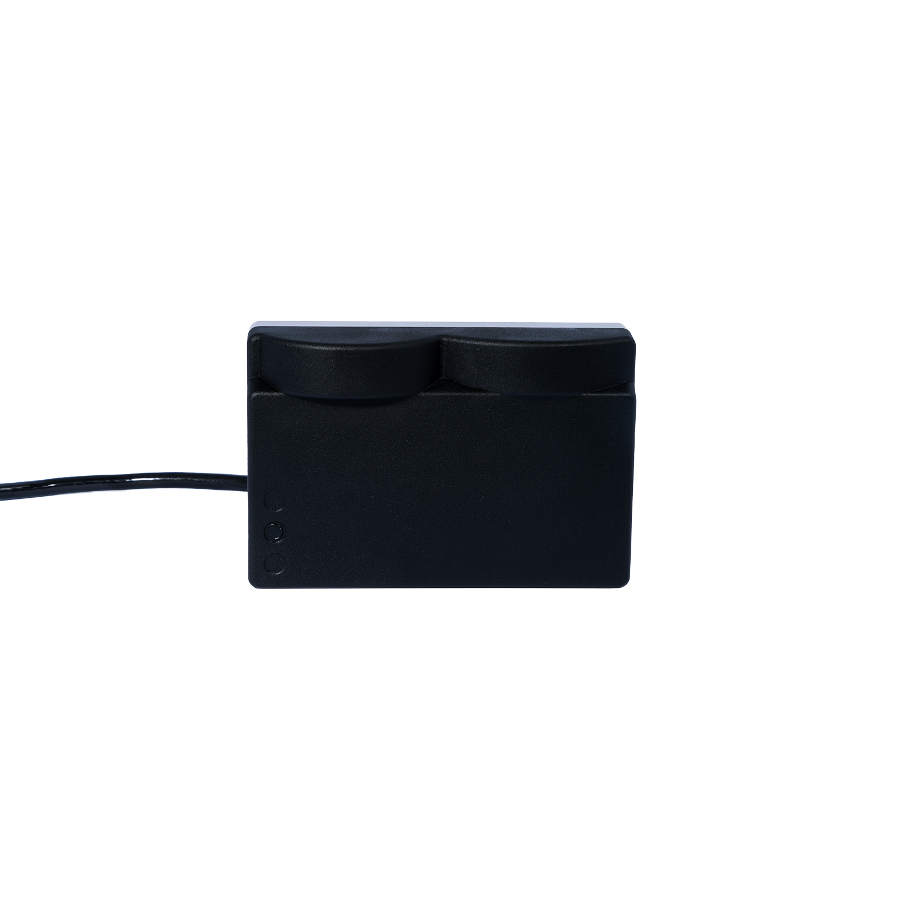

# Sonar 3D-15

The Water Linked Sonar 3D-15 is an advanced 3D multibeam imaging sonar designed to enhance underwater exploration and navigation. With real-time 3D imaging capabilities, it provides a comprehensive view of submerged environments, even in low-visibility conditions. Its compact design, weighing just 0.5 kilograms in water, and a depth rating of 300 meters make it suitable for a wide range of remotely operated vehicles (ROVs), from the smallest to larger models. The sonar offers a 15-meter acoustic range with a 90-degree horizontal and 40-degree vertical field of view. Users can access real-time data through a web-based Graphical User Interface (GUI) and integrate the system with third-party software via a detailed Application Programming Interface (API). This user-friendly design simplifies installation and operation, empowering users to navigate and identify targets effectively in challenging underwater conditions.

<!-- Insert image of 3d sonar below -->

