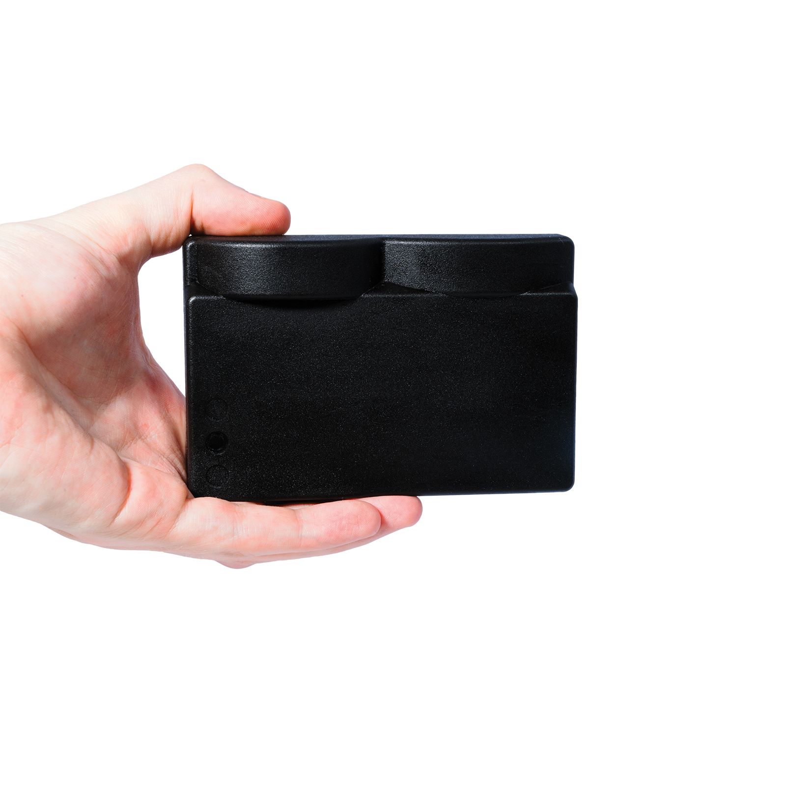

# Sonar 3D-15

* The Water Linked Sonar 3D-15 is an advanced 3D multibeam imaging sonar designed to enhance underwater exploration and navigation. 
* With real-time 3D imaging capabilities, it provides a comprehensive view of submerged environments, even in low-visibility conditions. 

<!-- Insert image of 3d sonar below -->

  

<!--  -->

## Dimensions

## Field of view

The Sonar 3D-15 provides an opening angle as described in the table below.

| Specification        | Range             |
|----------------------|-------------------|
| Pitch (opening)      | -20° to +20°      |
| Yaw (opening)        | -45° to +45°      |
| Vertical coverage    | 40° total         |
| Horizontal coverage  | 90° total         |

<!-- Insert drawing of Line of Sight -->

## Sonar 3D-15 Datasheet

[Datasheet](https://waterlinked.com/datasheets/sonar-3D-15)

