## Introduction

The Water Linked [DVLs](https://www.waterlinked.com/dvl) are designed to integrate with most ROVs and AUVs through ethernet and/or a serial interface (UART). To minimize the time between receipt of a DVL and having it up and running, the DVLs are shipped with an attached I/O interface, providing ease of connectivity with power, ethernet and serial. However, for most ROVs and AUVs, the DVL has to be integrated with the on-board electronics through a penetrator or a subsea connector.

This guide details how the [DVL-A50](dvl-a50.md) can be integrated with the BlueROV2. Exactly the same procedure can be carried out for the [DVL-A125](dvl-a125.md).

## Parts and tools

What parts and tools needed depends on whether you intend to permanently attach the DVL-A50 to the BlueROV2, have it semi-permanently attached, or use a subsea connector for quick installation/removal.

This guide details how to permanently attach the DVL-A50 to a BlueROV2.

### You will need

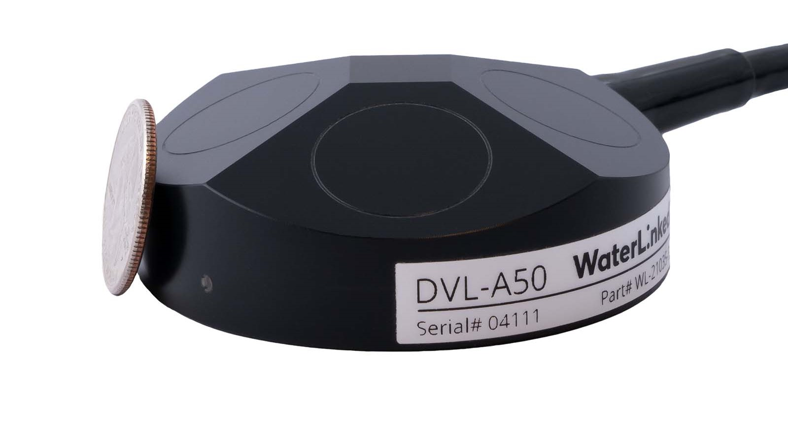

* [DVL-A50](https://waterlinked.com/shop/dvl-a50-114#attr=8,53)

* [BlueROV2](https://bluerobotics.com/store/rov/bluerov2/bluerov2/)

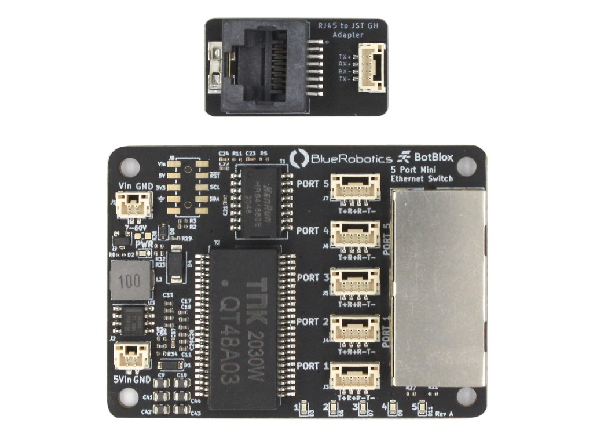

* Small ethernet switch. The one pictured here is from [BlueRobotics](https://bluerobotics.com/store/comm-control-power/tether-interface/ethswitch/), and ideal for use in the BlueROV2.

* [DVL-A50 Bracket](https://waterlinked.com/shop/dvl-a50-mounting-bracket-115#attr=). This is optional, but protects the DVL-A50 and allows for down to 0 cm minimum altitude.

You will also need:

* [Hex Key Set](https://bluerobotics.com/store/watertight-enclosures/enclosure-tools-supplies/tool-hex-set-r1/) from Blue Robotics
* [Bulkhead Wrench](https://bluerobotics.com/store/cables-connectors/tools/wlp-bulkhead-wrench/?attribute_bulkhead-size=M10) from Blue Robotics
* [Plug Wrench](https://bluerobotics.com/store/cables-connectors/tools/wlp-plug-wrench-vp/?attribute_plug-hex-size=14+mm+Hex+%28for+5.5+mm%2C+6.5+mm%2C+7.5+mm%2C+8.5+mm+penetrators%29) from Blue Robotics
* (Optional) [Cable Jacket Stripper](https://bluerobotics.com/store/cables-connectors/tools/cable-jacket-stripper/) from Blue Robotics
* [M10-7.5mm-HC WetLink Penetrator](https://bluerobotics.com/store/cables-connectors/penetrators/wlp-vp/?attribute_for-cable-diameter=WLP-M10-7.5MM-HC+%28for+7.0+mm+%C2%B1+0.3+mm+cable+diameter%29&attribute_package-quantity=1-Pack) from Blue Robotics
* [Silicone grease](https://bluerobotics.com/store/watertight-enclosures/enclosure-tools-supplies/molykote/)
* 5 mm universal drill bit
* 2 x M5x12 mm stainless steel pan head screws (included with BlueROV2 mounting bracket)
* 4 x M3x4 mm stainless steel countersunk flat head screws (included with BlueROV2 mounting bracket)
* Soldering iron
* Solder wire
* Wire cutter
* Tweezers or nose pliers
* Solder wick and/or desoldering pump
* Utility knife
* Wire stripping tool
* Zip ties
* 4 x 30 cm (12") wires (options discussed under [Connect DVL-A50 and BlueROV2](#connect-dvl-a50-and-bluerov2)). If possible, use 2 x red and 2 x black wires.
* 15 cm (6") ethernet cable

## Preparation

### Separate I/O Interface from DVL-A50

The first thing you will have to do before going about any of the installation options is to cut the DVL-A50 cable, separating the I/O Interface board. We recommend you do so near the end where the I/O Interface board is to begin with.

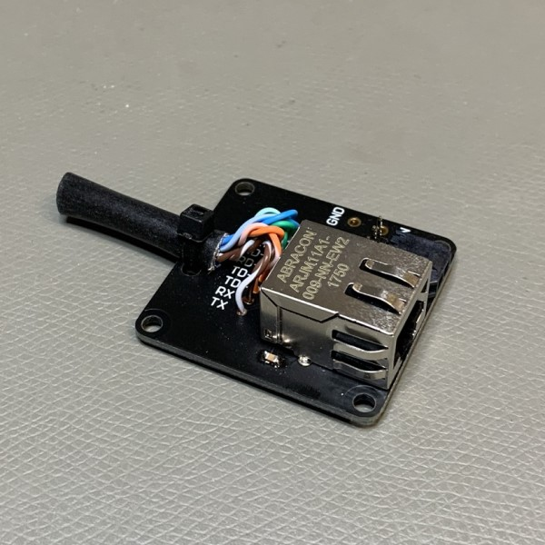

!!! Warning
	The DVL-A50 cable is permanently attached and non-replaceable inside the DVL-A50. If you cut the cable too short you will either have to splice the cable with another cable, or order a new DVL-A50. Measure twice, cut once!

### Attaching the BlueROV2 mounting bracket

* Attach the BlueROV2 mounting bracket to the DVL-A50 using the 4 x M3x6 screws provided with the DVL-A50 BlueROV2 Integration Kit.

The BlueROV2 mounting bracket can be attached to the BlueROV2 in one of the 2 places indicated in the image below (standard BlueROV2).

!!! Note
	In this configuration the DVL-A50 is pointing backwards meaning both the x-direction and the y-direction are flipped. Multiplying the velocity data in x- and y-direction with -1 will flip coordinates back again to the same perspective frame of the BlueROV2.

If your BlueROV2 has the Heavy Configuration upgrade, the BlueROV2 mounting bracket can be attached such that the DVL-A50 is within the BlueROV2 frame. This allows for a minimum working distance of 0 cm for the DVL-A50.

* Mark 2 hole positions on the BlueROV2 frame for attaching the BlueROV2 mounting bracket and drill through the frame using a 5 mm universal drill bit.

 

Check that the BlueROV2 mounting bracket will attach properly to the BlueROV2 frame using 2 x M5x16 mm screws. No need to secure the bracket in place as more work must be done on the cable end.

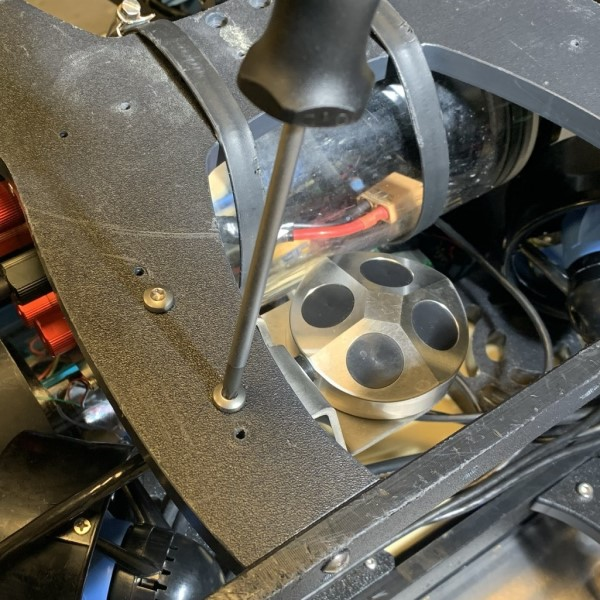

### Final cable lenght

With the DVL-A50 now attached to the BlueROV2 frame, find the appropriate cable length needed by leading the cable back to the penetrator end cap of the BlueROV2 and add the length of the electronics enclosure (30 cm) to the cable. This is the *minimum* required cable length.

!!! Tip
	We recommend adding at least another 30 cm to the cable to provide enough service loop in case the penetrator fails or the leads get damaged.

Cut the cable to the final length.

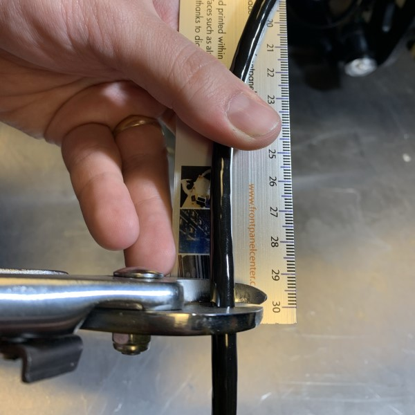

## Installation

The DVL-A50 will be permanently installed on the BlueROV2 with the I/O Interface board (supplied with the DVL-A50).

### I/O Interface preparation

To prepare the I/O Interface Board you will need:

* Soldering iron
* Wire cutter
* Tweezers or nose pliers
* Solder wick and/or desoldering pump

Cut off the zip tie holding the cable onto the I/O Interface board.

Cut off the individual wires soldered onto the I/O Interface board. Leave enough wire to grab onto with tweezers or nose pliers.

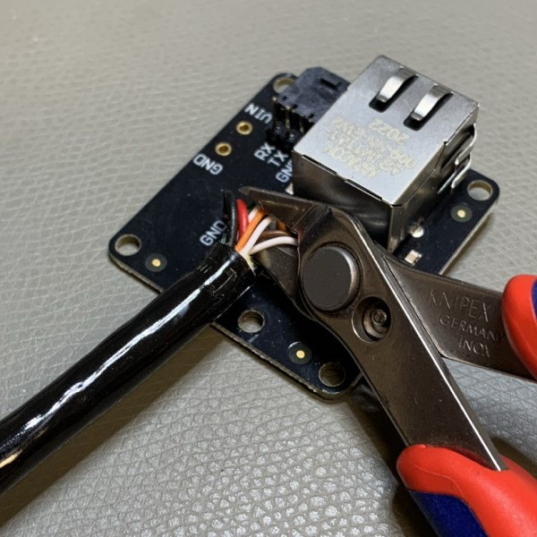

Desolder all the cut wires. Use solder wick and/or a desoldering pump to remove any excess solder from the now desoldered through hole pads.

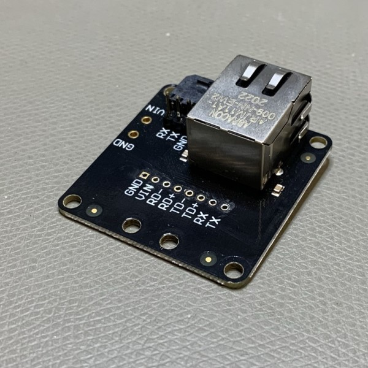

!!! Warning
	Using too much force or heat may delaminate the I/O Interface PCB, rendering the I/O Interface board useless.

### Adding a penetrator

To add a penetrator to the cable you will need:

* [Plug Wrench](https://bluerobotics.com/store/cables-connectors/tools/wlp-plug-wrench-vp/?attribute_plug-hex-size=14+mm+Hex+%28for+5.5+mm%2C+6.5+mm%2C+7.5+mm%2C+8.5+mm+penetrators%29) from Blue Robotics
* [M10-7.5mm-HC WetLink Penetrator](https://bluerobotics.com/store/cables-connectors/penetrators/wlp-vp/?attribute_for-cable-diameter=WLP-M10-7.5MM-HC+%28for+7.0+mm+%C2%B1+0.3+mm+cable+diameter%29&attribute_package-quantity=1-Pack) from Blue Robotics
* (Optional) [Cable Jacket Stripper](https://bluerobotics.com/store/cables-connectors/tools/cable-jacket-stripper/) from Blue Robotics
* Utility knife

Strip off 25-30 cm of the cable jacket using a cable jacket stripper, a utility knife or a sharp blade. Take care not to cut into the leads inside the cable. Blue Robotics has a great guide on cable stripping [here](https://bluerobotics.com/learn/cable-stripping/).

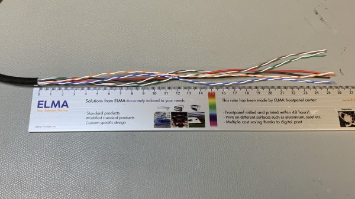

Follow the [WetLink Penetrator Assembly Guide](https://bluerobotics.com/learn/wetlink-penetrator-installation-guide/) by BlueRobotics to add a penetrator on the DVL-A50 cable.

### Removing a blank penetrator

To remove a blank penetrator from your BlueROV2, you will need the following tools:

* 2.5 mm hex driver
* [Bulkhead Wrench](https://bluerobotics.com/store/cables-connectors/tools/wlp-bulkhead-wrench/?attribute_bulkhead-size=M10) from Blue Robotics

To ensure your ROV is completely powered off, please remove the battery completely from the 3” enclosure and place to the side.

(Optional) Remove the fairings and buoyancy blocks by removing the self-tapping screws that hold the fairings to the frame.

Remove the 4” electronics enclosure from the ROV by removing the M3x16 screws that mount the enclosure to the ROV cradle.

Remove the Vent Plug from the Vent Penetrator Bolt on the electronics enclosure. Remove the 4″ tube and forward dome assembly from the rear end cap.

Remove a blank penetrator, sush as the one pictured below, from the 4” End Cap with the penetrator wrench.

### Install DVL-A50 penetrator

!!! note
	The following images shows the old penetrator from BlueRobotics. The procedure is the same with the new WetLink penetrators.

To install DVL-A50 into the end cap, you will need the following parts and tools:

* DVL-A50 with installed cable penetrator
* Penetrator O-ring (included with [M10-7.5mm-HC WetLink Penetrator](https://bluerobotics.com/store/cables-connectors/penetrators/wlp-vp/?attribute_for-cable-diameter=WLP-M10-7.5MM-HC+%28for+7.0+mm+%C2%B1+0.3+mm+cable+diameter%29&attribute_package-quantity=1-Pack) from Blue Robotics)
* [Bulkhead Wrench](https://bluerobotics.com/store/cables-connectors/tools/wlp-bulkhead-wrench/?attribute_bulkhead-size=M10) from Blue Robotics
* Silicone Grease
* Isopropyl Alcohol Wipe

Wipe the exterior surface of the electronics enclosure end cap clean with isopropyl alcohol or isopropyl alcohol wipes, and make sure it is free of any particles in the areas where the penetrator O-ring will sit.

Remove the O-ring from the bag

Install the O-ring onto the DVL-A50 cable penetrator and apply silicone grease to it.

 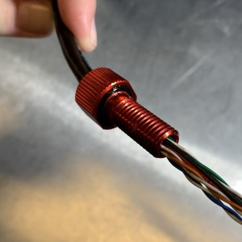

Push the wires throught the hole in the end cap where you previously removed a blank penetrator from.

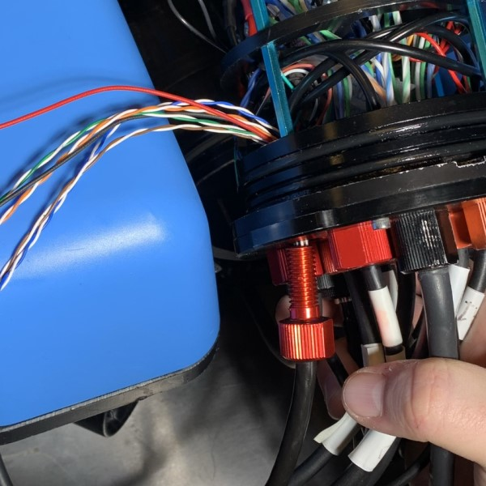

!!! Tip
	Since the penetrator has to be screwed on, adding a bit of tape around the end of the wires helps them stay untangles while turning. Also twisting the DVL-A50 cable in a clock-wise direction will aid in screwing on the penetrator.

Screw on the DVL-A50 cable penetrator to the end cap. Tighten to finger tight, then use the penetrator wrench to tighten it an additional ~1/16 of a turn. If you can’t loosen it with your fingers, it is tight enough.

 

### Reinstall I/O Interface Board

To reinstall the I/O Interface Board onto the DVL-A50 cable you will need:

* Wire stripping tool
* Soldering iron
* Solder wire
* Zip tie

With the DVL-A50 penetrator now through the 4" End Cap, strip off 2-3 mm of the ends of all the wires. Wire sizes are detailed in the table below. The blue pair can be removed as it is not used for the DVL-A50.

!!! Warning
	The two wires of a twisted wire pair are fully colored and fully white (the table below shows the white wires having a stripe of the complementing color, this is **not** the reality and only for reference). Keep track of which white wire is paired with which colored wire! Also note that the wiring in the images below differ from that of the table below. Please follow the table!

Re-solder the leads of the DVL-A50 cable to the I/O Interface board following the table below:

| DVL-A50 cable                                                  | I/O Interface pad | Function       | Diameter (mm) | AWG\# |
| -------------------------------------------------------------- | :--------------- | :------------- | :------------ | :---- |
|                | GND              | Power ground   | 0.6 mm        | 22    |
|                    | VIN              | Power in       | 0.6 mm        | 22    |
|  | TD+              | Ethernet TX+   | 0.6 mm        | 22    |
|              | TD-              | Ethernet TX-   | 0.4 mm        | 26    |
|    | RD+              | Ethernet RX+   | 0.4 mm        | 26    |
|                | RD-              | Ethernet RX-   | 0.4 mm        | 26    |
|    | TX               | Serial UART TX | 0.4 mm        | 26    |
|                | RX               | Serial UART RX | 0.4 mm        | 26    |

  

Zip tie the soldered wires to the I/O Interface board to protect the solder joints.

### Connect to BlueROV2

To connect the DVL-A50 to the BlueROV2 you will need:

* 2 x 30 cm (12") wires for power to the DVL-A50
* [BlueRobotics ethernet switch](https://bluerobotics.com/store/comm-control-power/tether-interface/ethswitch/)
* 6" ethernet cable
* Zip ties

To provide power to the DVL-A50 you can either use (A) a 2-pin [Molex MicroFit3.0 cable assembly](https://octopart.com/214751-2022-molex-109474124), (B) solder on a [Würth screw terminal](https://octopart.com/691137710002-w%C3%BCrth+elektronik-78871135), or (C) directly solder on 2 wires to the power pads.

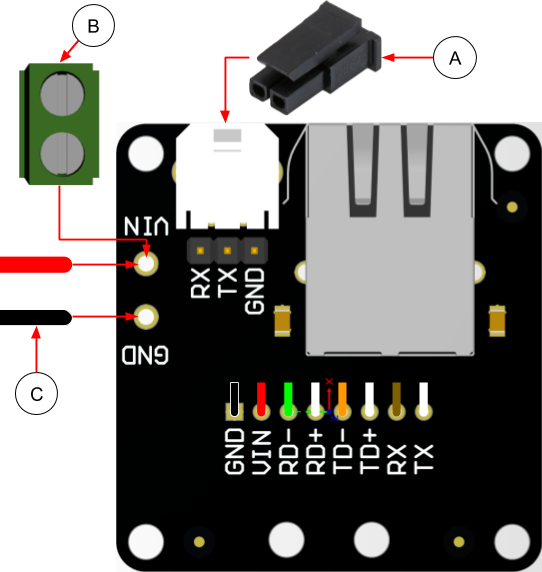

* Connect VIN to the positive Power Terminal Block inside the BlueROV2 by either stripping off 6-8 mm of the wire and screw it in place, or add a spade terminal for a \# 6 screw (M3.5) and screw in place.

* Connect GND to the negative Power Terminal Block by either stripping off 6-8 mm of the wire and screw it in place, or add a spade terminal for a \# 6 screw (M3.5) and screw in place.

!!! Warning
	The Power Terminal Blocks are unregulated and directly connected to the battery. Any short may generate several amps which will fry most circuits. Check that the wires are secured properly in both ends.

Install the BlueRobotics ethernet switch following the [Ethernet Switch Installation Guide for the BlueROV2](https://bluerobotics.com/learn/ethernet-switch-installation-guide-for-the-bluerov2/) by BlueRobotics.

With power and ethernet switch now sorted, connect a 6" ethernet cable from the ethernet switch to the IO Interface board.

!!! Tip
	Some thick double-sided sticky tape and zip ties can be used to secure the I/O Interface to the electronics frame inside the BlueROV2.

### Reassemble BlueROV2 electronics enclosure

To reassemble your BlueROV2 Electronics Enclosure, you will need the following parts and tools:

* 4 x M3x16 screws that were placed off to the side during disassembly
* Silicone Grease
* 2.5 mm hex driver

Reinstall 4” Watertight Enclosure onto ROV with the following steps:

* Apply silicone grease to the two radial O-rings on the O-Ring Flange (4” Series) that is attached to the Electronics Tray.
* Install the Watertight Enclosure (4” Series) with installed Dome End Cap to the O-Ring Flange (4” Series).

!!! Warning
	Use caution when sliding the 4" Watertight Enclosure over the electronics as space may be tight (collides with electronics) and wires can get trapped between the 4" tube and the 4" end cap.

Mount the Electronics Enclosure to the frame using the M3x16 screws so that the dome is on the same side as the front center panels (the center panels without the 3 large holes). Install the M3x16 screws through the clips and into the Enclosure Cradle (4” Series). It is easier to install these screws if the clips are not fully tightened until all screws are through the clips and threading into the Enclosure Cradle (4” Series). This allows clips to rotate so you can find the threaded hole in the Enclosure Cradle (4” Series) easily.

### Attach DVL-A50 to BlueROV2

!!! note
	The following images show the old version of the DVL-A50 with steel housing. The new housing has the same dimensions as the old.

Attach the DVL-A50 to the BlueROV2 using the 2 x M5x16 screws provided with the DVL-A50 BlueROV2 Integration Kit through the two holes you've made previously.

Excess cable can be bundled together and attached to the BlueROV2 frame using zip ties.

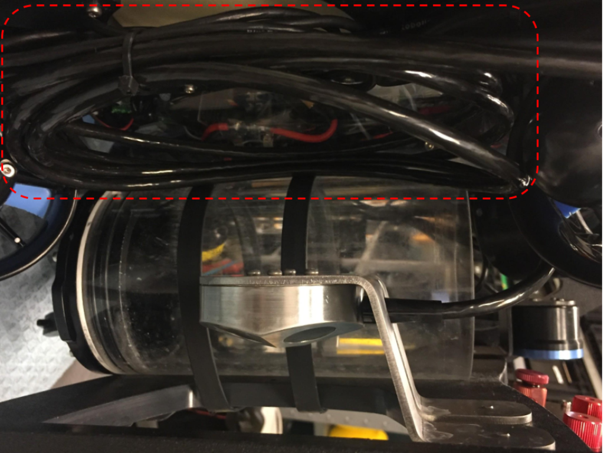

## Software

The DVL-A50 requires an extension in BlueOS to be able to communicate with the autopilot (Pixhawk or Navigator flight controller).
BlueOS has to be updated to **BlueOS 1.1.0** or newer to assure that extensions are supported sufficiently.
After the update install the latest BlueOS-Water-Linked-DVL extension from the BlueOS extension manager.

* Open the interface of the DVL-extension and click the button "Load parameters for DVL". Those parameters are persistent over reboots, which means that this button only needs to be pressed once and not every time you restart the ROV.

* Restart the autopilot for the parameter changes to take effect. It is not necessary to restart BlueOS.

* Set the global vehicle position in the DVL extension every time you start the ROV.

!!! Note
	There is a known bug where the I2C address of the pressure sensor is set wrong, and so depth is not received properly. This can be fixed by setting the parameter `BARO_PROBE_EXT` to `768` and then reboot the ROV.
