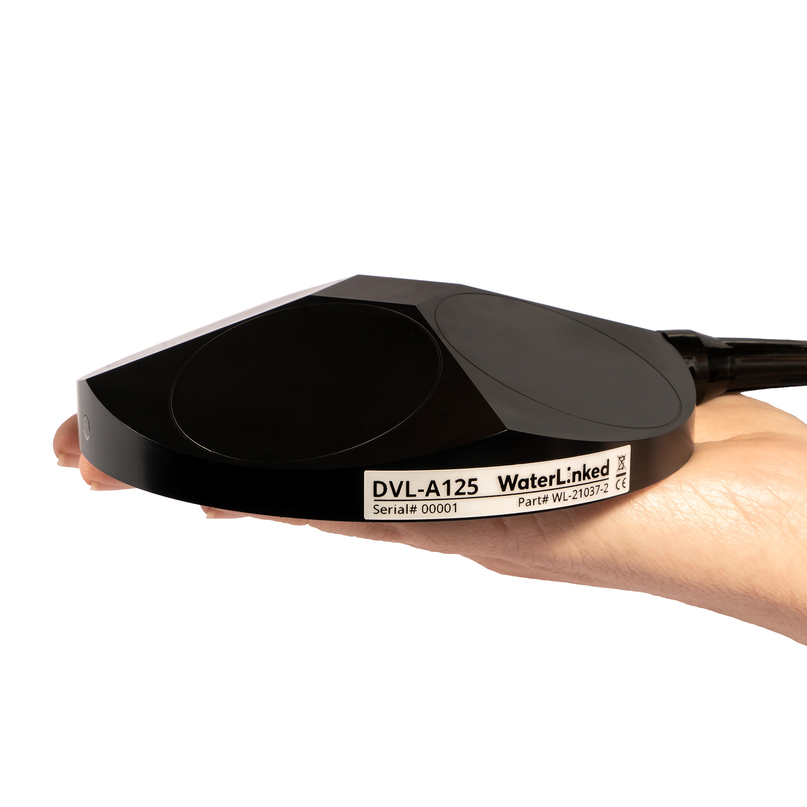
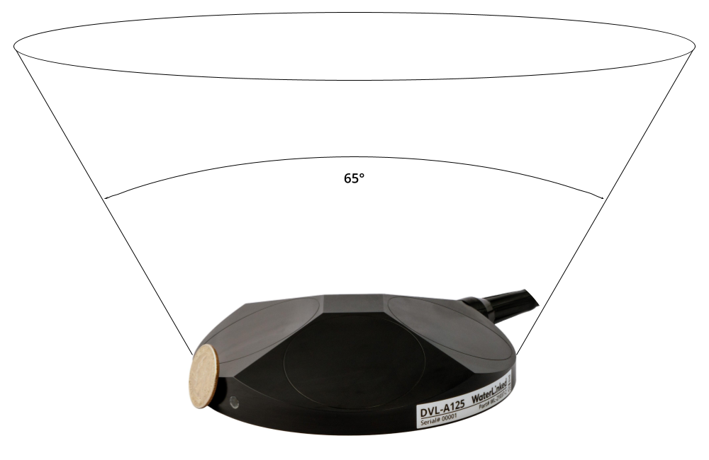

# DVL-A125

[Buy DVL-A125 here!](https://waterlinked.com/product/dvl-a125/)

## Description
The [DVL-A125](https://www.waterlinked.com/dvl/dvl-a125) is the next step up from the [DVL-A50](https://www.waterlinked.com/dvl/dvl-a50), providing even better performance at greater distances while still keeping a small form factor relative to competing DVLs.

The DVL-A125 builds on the already impressive feats of the DVL-A50 with its increased performance, small 4 beam setup, open interface protocol and mid-to-low cost.

The DVL estimates velocity relative to the sea bottom by sending acoustic waves from the four angled transducers and then measure the frequency shift (doppler effect) from the received echo. By combining the measurements of all four transducers and the time between each acoustic pulse, it is possible to very accurately estimate the speed and direction of movement.

!!! Tip
	Keep the DVL-A125 in a bucket of water to ensure sufficient cooling when using the DVL on a workbench.

## Dimensions

## Mounting Holes

## Transducer numbering

## Transducer beam width

Half-power beam width is 4.1°

## Line of sight

## Datasheet

[Datasheet](https://waterlinked.com/dvl-a125#Downloads-%2F-Resources%E2%80%8B)
