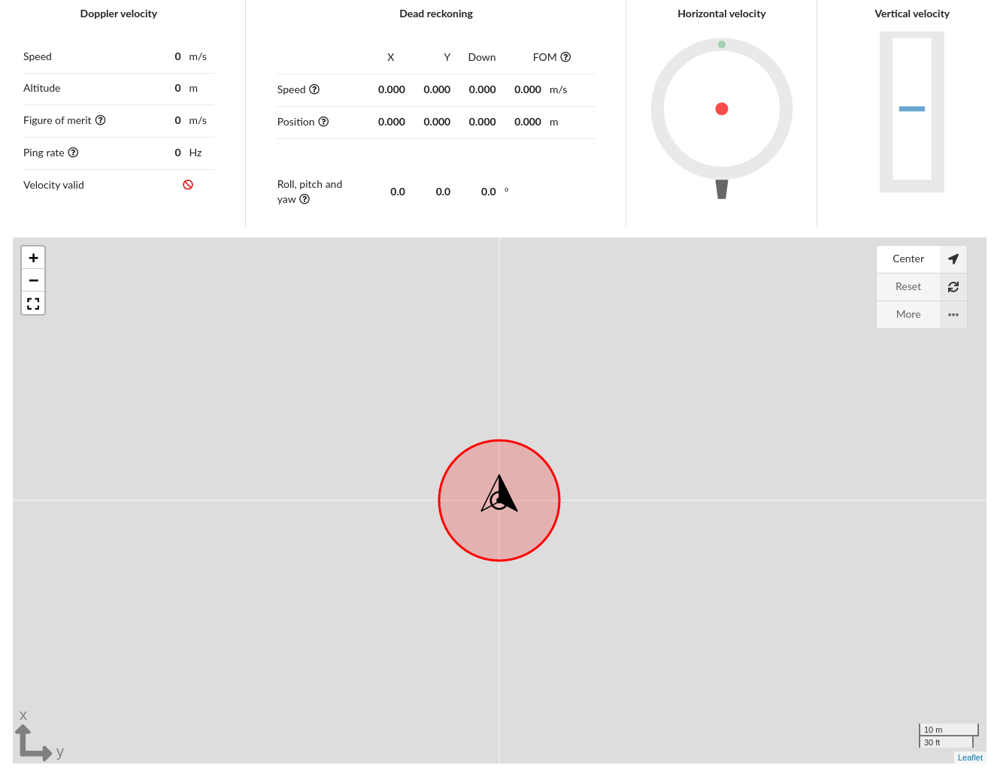

# Dashboard

Both the DVL-A50 and the DVL-A125 have a web-based GUI. In your favorite web browser, simply navigate to the DVL's [IP address](../../networking).

The default page is a dashboard which provides a summary and visualisation of both the velocity and [dead reckoning](../../dead-reckoning) data outputted by the DVL, as well as an indication of current status.

## Screenshot

## Map controls

Button                                  |Description
----------------------------------------|-----------------------------------------------------------------
+/-/[ ]                                 |Zoom and fullscreen controls
   | Center map to dvl position
   | Reset calculated position and start position tracking from zero.
...                                     |More
                                        |Set trailing
                                        |Set grid
                                        |Calibrate gyro
