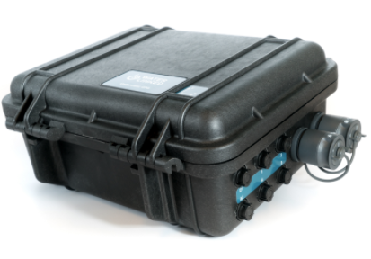
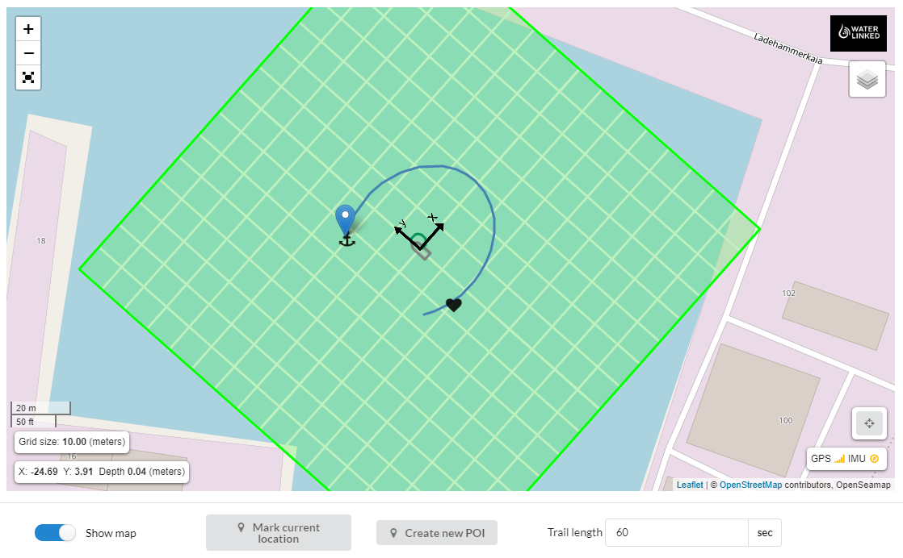

# Introduction

## Underwater GPS Explorer Kit 

 

The Underwater GPS Explorer Kit is a robust and reliable acoustic positioning system with a range of 100m. The purpose of the system is to give a live GPS position of ROVs, divers and other moving objects below the water surface.

 

The Underwater GPS system is based on Short Baseline (SBL) acoustic positioning. The Locator is placed on the device to be positioned and functions as a beacon that send out an acoustic pulse. Near the surface, there are four Receiver hydrophones lowered into the water. The Receivers listen for the pulse from the locator. Time-of-arrival to each Receiver is used to calculate the Locator’s position. SBL systems, compared to the USBL systems, have the advantage of working well in shallow water and acoustic reflective environments, such as in fish cages, near harbor installations, close to ship hulls, inside water tanks etc.

Once the position is known relative to the Receivers, the global position can be found by adding that to the position obtained by a GPS receiver. The Underwater GPS system does that part internally so that it can provide the actual global position of the ROV as it's output.

## Kit content

* 1 x Underwater GPS Housing with Master-D1 electronics 
* 4 x Receiver-D1 with 10m cable 
* 1 x Locator of choice
* 1 x 3m Ethernet cable
* 1 x 3m power cable
* 1 x External GPS antenna

## Quickstart

[Getting started with Waterlinked Underwater GPS](quickstart.md)

## User Manual

The information in this site was earlier available in a PDF which is now outdated but useful for offline use.

[Outdated Water Linked Underwater GPS User Manual](https://waterlinked.com/wp-content/uploads/2017/08/W-DN-17002-2_Underwater_GPS_User_Manual.pdf)

## Collaboration

This document is created using markdown and is hosted on GitHub. If you find something that is not documented well enough, typos or any other mistakes. Please open an issue or create a pull request to fix the problem.  Or just simply hit the edit button on the top of the page.

## Discussion

If you have more questions which is not answered on this page please go to our [forum](https://waterlinked.com/forums/forum/underwater-gps/) where we will be happy to answer you.

[Datasheet](https://www.waterlinked.com/datasheets/underwater-gps-explorer-kit/)