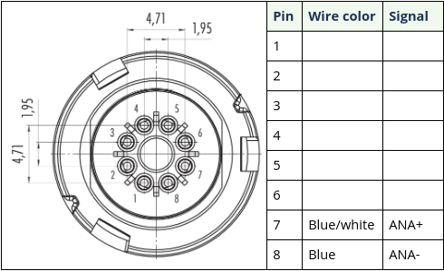

# Locator-A1

[Buy Locator-A1 here!](https://waterlinked.com/shop/underwater-gps-g2-locator-a1-120)

## Description

The Locator-A1 has the smallest physical footprint in our series of locators. It can be integrated into even the most compact ROVs. The Locator-A1 does not carry its own depth sensor, and the Master-D1 requires that the depth be provided from your underwater vehicle (ROV etc.) This can be achieved by means of the [UGPS API](../gui/api).

## Wiring interface

The tables below shows the pinning of the A1 interface connectors.

## Dimensions

## Datasheet

[Datasheet](https://waterlinked.com/underwater-gps-accessories#Downloads%2FResources)
