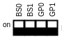
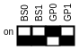

# Network Settings

At power-up, the Master-D1 reads the DIP-switch settings. The network mode depends on the GP0 and GP1 position.

| Network mode             | GP0                  | GP1                  | DIP switch position |
| ------------------------ | :------------------- | :------------------- | :------------------- |
| DHCP client              | ON                   | ON                   |  |
| Static IP 192.168.2.94   | OFF                  | ON                   |  |
| Static custom IP         | ON                   | OFF                  |  |
| DHCP Server, 192.168.0.1 | OFF                  | OFF                  |  |

The BS0 and BS1 positions on the dip switch shall both be ON. These boot-select pins are used in factory programming only.

Use the supplied Ethernet cable to connect the Underwater GPS to a network switch or directly into the host computer.

!!! note
    The host computer connected to the topside unit needs to have an IP-address on the same subnet as set on the Master-D1.
    For example: If the IP address of the UGPS is 192.168.2.94 the host computer needs to be configured to a different 192.168.2.x address e.g. 192.168.2.100.