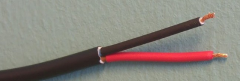

# Power supply

The power cable comes with stripped jacket. Connect the stripped cables to your favorite 12V power source.

|           |                     |
| --------- | :------------------ |
| Black   : | Negative            |
| Red     : | Positive            |
| Voltage : | 10 – 18V            |
| Current : | 0.7A  (12V nominal) |
|   |   |