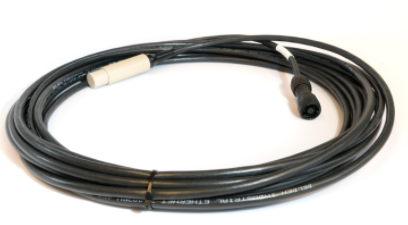
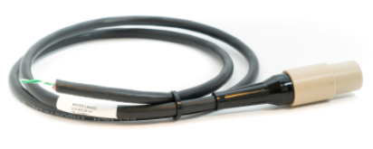
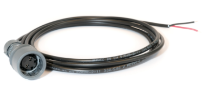

# General

## Kit content

|        Qty          | Part number          | Name                 | Image                |   
| ------------------- | :------------------- | :------------------- | :------------------- |
| 1                   | WL-11001             | Underwater GPS Housing  with Master-D1 electronics |  |
| 4                   | WL-21005             | Receiver-D1 with 10m cable |  |
| (1)                 | WL-21009             | Locator-A1 with 1m cable and  no connector |  |
| (1)                 | WL-21016             | Locator-D1 with 100m cable.  The Locator-D1 does not  come as standard. |  |
| 1                   |                      | 3m Ethernet cable    |  |
| 1                   |                      | 3m power cable       |  |
| 1                   |                      | External GPS antenna |                                | 
|   |   |   |   |

## Connectors

## Master-D1 Electronics

