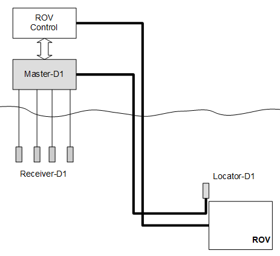
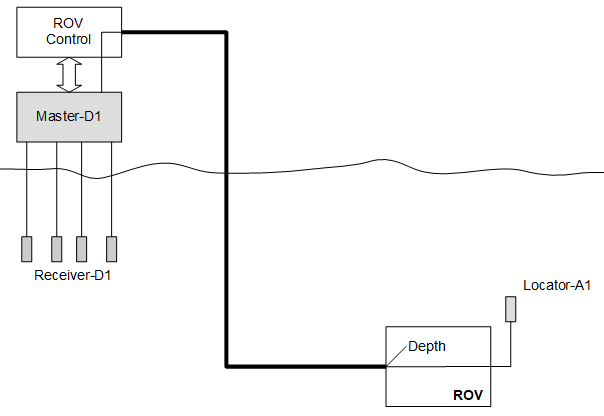

# Hardware Setup

## Network

At power-up, the Master-D1 reads the DIP-switch settings. The network mode depends on the GP0 and GP1 position. 

| GP0                 | GP1                  | Network mode         | DHCP client example mode |   
| ------------------- | :------------------- | :------------------- | :------------------- |
| ON                  | ON                   | DHCP client          |     |
| OFF                 | ON                   | Static IP 192.168.2.94 |                      |
| ON                  | OFF                  | Static IP 10.11.12.94 |                      |
| OFF                 | OFF                  | DHCP Server, 192.168.0.1 |                      |
|   |   |   |   |

The BS0 and BS1 positions on the dip switch shall both be ON. These boot-select pins are used in factory programming only.

Use the supplied Ethernet cable to connect the Underwater GPS to a network switch or directly into the host computer. 

## Acoustics

• Connect the four Receiver-D1 cables to channel 1 to 4 on the housing, ref chapter 2.2

• If using the Locator-D1, connect this to the D1 connector on the housing, ref chapter 2.2

• If using the Locator-A1, connect this to the A1 connector on the housing, ref chapter 2.2

## Power

The power cable comes with stripped jacket. Connect the stripped cables to your favorite 12V power source.

|           |                     |
| --------- | :------------------ |
| Black   : | Negative            |
| Red     : | Positive            |
| Voltage : | 10 – 18V            |
| Current : | 0.7A  (12V nominal) |
|   |   |

## Locators

The Underwater GPS can be used with two different types of Locators, Locator-A1 and Locator-D1. The Locator-A1 is recommended when integrating on ROVs. See comparison table bellow.

| Parameter           | Locator-D1           | Locator-A1           |  
| ------------------- | :------------------- | :------------------- |
| Technology          | Digital              | Analog          |
| Intended use        | Retrofit ROV or compressed diving | Full ROV integration |
| Signal              | 3x twisted pair (RX, TX and power) | 1x twisted pair (TX) |
| Cable length        | Max 100m             | Max 300m |
| Depth sensor        | Integrated           | No depth sensor. The ROV control system  must write the ROV depth using the API to  the Master-D1 electronics.  |
| Block diagram       |  |  |
| Picture             | **INSERT IMAGE HERE** | **INSERT IMAGE HERE** |
|   |   |   |

## Reference Systems

In order to calculate the absolute position of the Locator we need to define two reference systems, the acoustic and the global reference system. The global reference system is defined by latitude and longitude and is the reference system used by the GPS and in maps.

The acoustic reference system  (the x and y axis) is defined by the orientation of the housing. The housing is by definition located in origin (x=0, y=0).  A label on top of the lid indicates the x-y coordinate system. The position of the receivers and the search area are specified in the Acoustic reference system.

## Guidelines

You can in principle place the receivers at any location within 100m from the origin of the acoustic reference system. In order to ensure the best performance, you should follow a few guidelines:

|                     |                      |
| ------------------- | :------------------- |
| **Line-of-sight**   | Try to place the receivers so they all have a free line-of-sight to the Locator. |
| **Good Separation** | The system performs better when there is a large distance between the   receivers. More separation is better, but 2x2 meters is sufficient for good  performance.   |
| **Max Range**       | There should be maximum 100m from any receiver to the Locator |
| **Receiver depth**  | Place the receivers at a few meters depth. Near the surface there are typically  small air bubbles caused by waves. These small air bubbles attenuate the  acoustic signal and can reduce the system performance.              |
| **Limit search area** | You will get a better position if you help the search algorithm to narrow the  search area. Limit the search range setting to the area where the Locator is  expected to be. |
| **Directivity**     | The Receivers have less sensitivity in backward direction (where cable enters).  Also, the Locator has less acoustic gain in the direction of the cable entry.  |
| **Receiver stability** | Add some weight to the receivers so they hang straight down in the water  |
| **On board GPS**    | If the master electronics is static during operation it is recommended to use the  static option for the GPS. This is to remove the inaccuracy of the GPS receiver  in global position. Only use onboard GPS when the reference system is moving  eg. if mounted to a boat.  |
|   |   |

## Boat Example

The illustration bellow shows a typical receiver configuration when installed on a boat. The receivers are hanging from the side of the boat, one in each corner. The depth of the receivers are typically 2-4m, deep enough to get below the hull and get free line-of-sight to the Locator. Notice how the housing defines the origin and coordinate system of the acoustic reference system.

## GPS

The on-board GPS module is used to position the system in a global reference system. An external antenna with integrated amplifier is used to improve GPS reception. The signal strength of the GPS can be seen on the top bar in the web GUI.

### GPS-antenna assembly

The GPS-antenna can be mounted anywhere you want, but remember the GPS-antenna is the origin of the master electronics position. Therefor it is recommended to fasten the antenna on the lid of the pelican case. With the 3M double sided tape, attach the GPS- antenna to the lid of the pelican case.

Connect the GPS-antenna cable to the SMA connector on the master electronics. Torque the SMA nut to 3–5 in·lbf (0.3 to 0.6 N·m) or slightly more than finger tight.

## IMU

The master electronics has an built in IMU used to provide the orientation of the master electronics. This is used in combination with the acoustic position and GPS to generate the global position of the Locator.

### IMU Calibration

For the IMU to work properly it needs to be calibrated. The calibration data is stored when full calibration is obtained for faster calibration on restart of the system. If the system is started on a new location a new calibration is needed for the IMU to work as intended. 

To calibrate the IMU disconnect all Recivers and Locator cables, but leave power and Ethernet connected. While looking at the top bar in the web GUI on the IMU status bar move the pelican case in a figure of 8 until all the bars are green. 
