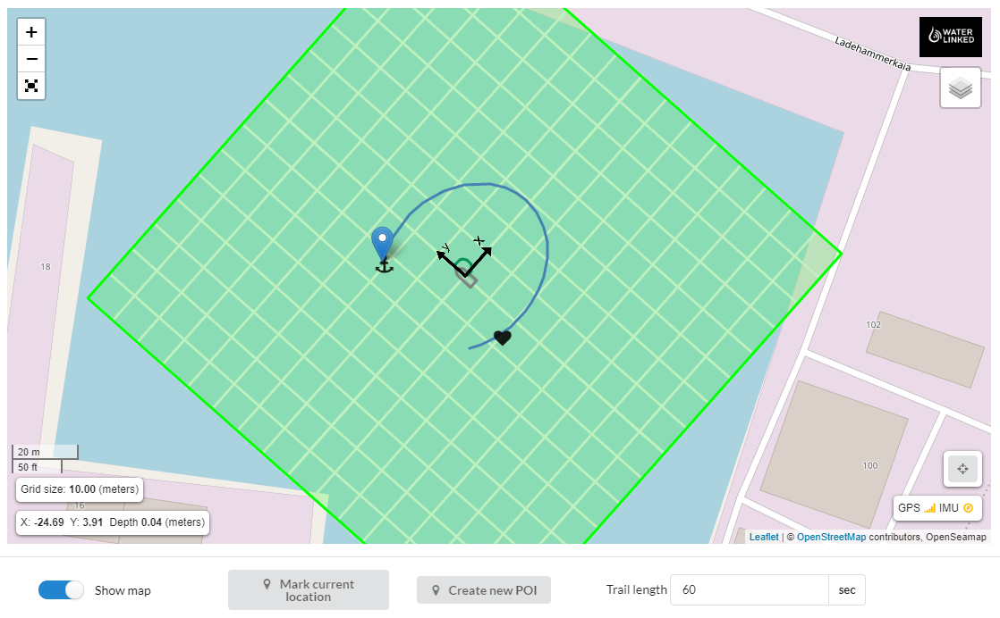

# Introduction

The Underwater GPS is a robust and reliable acoustic positioning system with a range of 100m. The purpose of the system is to give a live GPS position of ROVs, surface-supplied divers and other moving objects below
the water surface. 

The Underwater GPS system is based on Short Baseline (SBL) acoustic positioning. The Locator is placed on a ROV or diver and functions as a beacon that sends out an acoustic pulse. Near the surface, there are four receiver hydrophones lowered into the water. The receivers listen for the pulse from the locator. Time-of-arrival to each receiver is used to calculate the Locator’s position. SBL systems, compared to the USBL systems, have the advantage of working well in shallow water and noisy acoustic environments, such as in a fish cage.

Once the position is known relative to the receivers, the global position can be found by adding that to the position obtained by a GPS receiver. The Underwater GPS system does that part internally so that it can provide the actual global position of the ROV as it's output.

