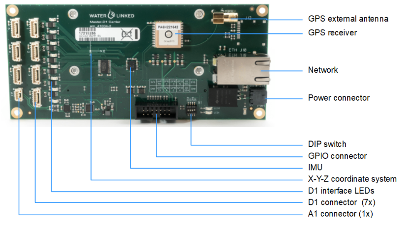

# Master-D1 Electronics

## Description

The Master-D1 is a digital acoustic position computing board. It calculates the position of any Locator relative to the position of the Receivers, as well as global position through use of the integrated GPS and IMU (compass). The board supports up to 7 independent D1 devices, 1 A1 device or 1 U1 device. It is accessed through a network interface. The Master-D1 is running its own webserver which exposes an API and a GUI. With its small physical footprint, the board is easily integrated into a topside housing.

## Benefits

* Extremely small footprint enabling easy integration in other equipment.

* Highly robust operation in areas with reflections (shallow water, around installations etc.)

## Wiring interface

Make sure the LED is ON for all D1 interfaces that are connected. The digital D1 interfaces all have a separate LED to show if the communication link is in lock. When a Receiver-D1 or Locator-D1 cable is connected to the master board, the corresponding LED should be continuously ON. The silkscreen marking of the channel LEDs on the PCB are 0-indexed. The channel labels on the housing are 1-index. We thus get following LED channel mapping:

| Interface           | LED |
| :------------------ | :-- |
| Receiver, channel 1 | 0   |
| Receiver, channel 2 | 1   |
| Receiver, channel 3 | 2   |
| Receiver, channel 4 | 3   |
| Locator-D1          | 6   |
|   |   |

The LED on the Locator-A1 interface is not in use.

## Dimensions

The diagrams below shows the mechanical dimensions of the Master-D1 electronics.

## Setup

## Datasheet

[Datasheet](https://www.waterlinked.com/hubfs/Product_Assets/W-MK-17025-5_Master-D1.pdf)
