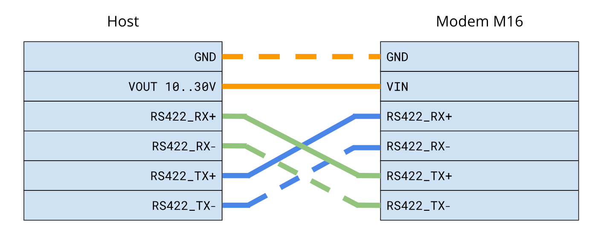

# Modem-M16

The Modem M16 is a two-way, half-duplex acoustic modem operating at 10bps that can function dependably in the presence of other modems configured on distinct channels. Boasting an impressively compact size, minimal power consumption, and affordable cost, the Modem M16 is a groundbreaking addition to the field. This innovation paves the way for successful underwater communication in complex environments, particularly where power resources for sensors are scarce.
[Buy Modem-M16 here!](https://waterlinked.com/shop/modem-m16-186)

## Description

The Modem M16 is a two-way half-duplex 10bps acoustic modem with a robust and user configurable data link. The modem is delivered in three different versions, [OEM](https://waterlinked.com/shop/modem-m16-186#attr=111), [Standard](https://waterlinked.com/shop/modem-m16-186#attr=110), and [Extended (RS422)](https://waterlinked.com/shop/modem-m16-186#attr=112)

## Terminal Interface

The Modem-M16 has a 3.3 volt UART interface and a RS422 interface.

| Settings         | Value  |
| :--------------- | :----- |
| Baud rate        | 9600   |
| Data parity stop | 8N1    |
| Flow control     | None   |

## Wiring interface

The tables below shows the pinning of the Modem-M16 interface. Depending on which type is used, the wires may have different colors. 

| Interface             | Colour (OEM)  | Colour (Standard) | Colour (Extended)|
| :---------------------| :---------------- | :---------------  | :---------------  |
| VIN                   | Orange (3V - 4.2V)| Orange (3V - 4.2V)| Orange (10V - 30V)|
| GND                   | Orange-White      | Orange-White      | Orange-White      |
| UART RX               | Blue              | Blue              | NA                |
| UART TX               | Blue-White        | Blue-White        | NA                |
| Shutdown (Active Low) | Green             | Green             | NA                |
| RS422 RX+             | NA                | NA                | Blue              |
| RS422 RX-             | NA                | NA                | Blue-White        |
| RS422 TX+             | NA                | NA                | Green             |
| RS422 TX-             | NA                | NA                | Green-White       |

Note: Shutdown line can be used to control the ON/OFF state of the Modem. 
If Shutdown is left floating, the Modem is ON. If Shutdown is short to GND, the modem is OFF. 
Shutdown line can be controlled by an external open-drain, open-collector or relay device.
DO NOT apply voltage to Shutdown line. 

## Wiring OEM/Standard

## Wiring Extended (RS422)

## Mechnical

| Information               | All Modem M-16 Versions                |
| :------------------------ | :------------------------------------- |
| Device length             | 47 mm (ex cable)                       |
| Device weight (air)       | 40 gram                                |
| Device weight (submerged) | 14 gram                                |
| Depth rating              | 600 meter                              |
| Materials                 | POM (housing),  PEEK (transducer) |
| Operating temperature     | -10 to 70 °C                           |
| Device diameter           | 29.5 mm                                |

## Acoustics

| Information               | All Modem M-16 Versions                |
| :------------------------ | :------------------------------------- |
| Range                     | 1000 m                                 |
| Transducer directivity    | Omnidirectional                        |
| Transducer frequency      | 58.5 kHz                               |
| Bits per package          | 16                                     |
| Package duration          | 1.6 seconds                            |

