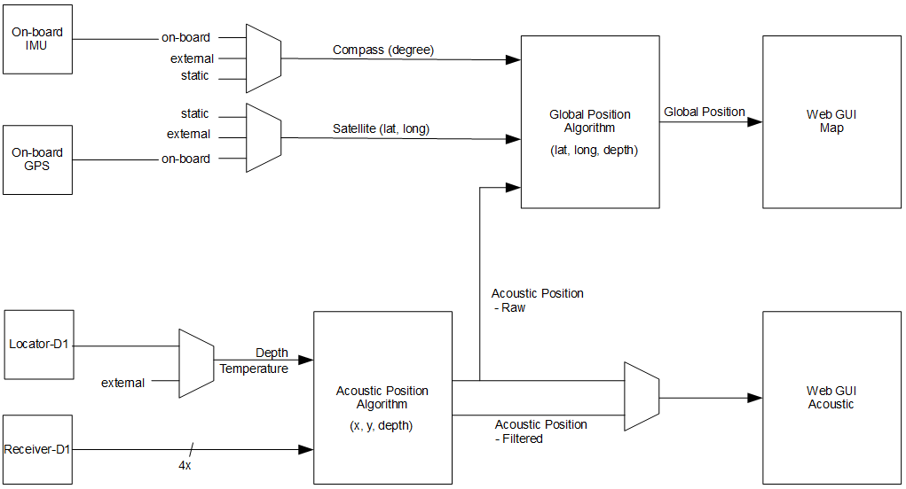

# Software

## Signal flow

The diagram below shows the major signal processing blocks and how they are connected.

## Architecture

The block diagram below shows how the Web GUI and API are interconnected with the rest of the internal system. 

## GUI

The Underwater GPS GUI is web based. Using your favorite web browser, go the IP address as defined in chapter 3.1. We currently support and recommended Chrome, Firefox and Safari. 

NB: Internet Explorer is not supported as of now.

### Configuration page

| # | Description          | API                  |  
| - | :------------------- | :------------------- |
| 1 | The system configuration is stored on the server. Press “Store configuration” to  save current configuration. The current setting are automatically loaded when the  page is opened. |                   |
| 2 | Configuration of the receiver position. Set the coordinates (x,y,depth) of all four  receivers [meters]. The depth is always a positive number.  | /config/receivers |
| 3 | The visualization sector gives a graphical representation of the receiver positions.  This makes it easier to verify that the configuration is correct.  |                   |
| 4 | This button sets search area to ± 100m  |                   |
| 5 | Configuration of the active search range. Set the maximum/minimum of the x and  y search area. To improve the quality of the position estimation it is a good idea to  define a small search area and leave out “impossible” position sectors. | /config/generic   |
| 6 | Setting of the acoustic frequency. This can be used in case other acoustic devices  operate in the area, like sonars, echo sounders and modems. In case of  interference, change the carrier frequency.   | /config/generic   |
| 7 | Configuration of the master (housing) position. This configuration selects how to  map the two reference systems, the Global and the Acoustic reference system.  There are three sources of this  • On-board GPS. With this setting the global position of the master is based    on the on-board GPS.  • Static. The latitude and longitude are static numbers and configured  directly in GUI.  • External. The GPS position in provided through the API, typically from the   boat navigation system.  |                   |
| 8 | Configuration of the orientation of the master.  There are three sources of this • On-board IMU. With this setting the orientation of the master is based on      the on-board IMU. • Static. The heading of the master is static. The heading is configured  directly in GUI.  • External. The heading is provided through the API, typically from the boat  navigation system or compass.  |                   |
| 9 | Locator selection. When using Locator-A1, the depth must be written to the  system. This is done via the HTTP interface described in the Open API  Specification (OAS) |                   |
|   |   |   |

## API

The Underwater GPS comes with an easy-to-use API. This API uses a HTTP-based scheme to interact with the system. Through the API the user can among others

• set configuration settings

• read acoustic and global position data

• read GPS and IMU raw data

SWAGGER is used for API documentation. See 
[demo.waterlinked.com/swagger](http://demo.waterlinked.com/swagger) for more information.

## SW update

A SW update package (.wlup) includes all files required to update the system. Some SW updates also requires an update of the low-level FPGA image. The FPGA image is encrypted with a unique key. To generate a new FPGA image for your board, Water Linked needs to know the Chip ID of your bard. The Chip ID can be found in the About tab of the GUI. To get the latest software package for your kit, go to [update.waterlinked.com](http://update.waterlinked.com) and enter the Chip ID of your kit. 

| Step | Description          | API                  |  
| -    | :------------------- | :------------------- |
| 1    | Power off the system |  |
| 2    | Set Master-D1 to fixed IP “192.168.2.94” | See chapter 3.1 |
| 3    | Set the IP on your own computer to be on the same  sub-net |  |
| 4    | Power up the system while at the same time keeping  the GP0 pin on the GPIO connector grounded |  |
| 5    | Go to web GUI [http://192.168.2.94](http://192.168.2.94) |  |
| 6    | After the system has booted and you see the  upgrader GUI, remove the grounding of GP0. |  |
| 7    | Click “Browse file” and select correct <>.wlup file |  |
| 8    | Wait for update process to complete |  |
| 9    | When the update process is complete and successful, the system will automatically reboot to standard mode |  |
| 10   | Verify that the SW version has updated |  |
|   |   |   |
