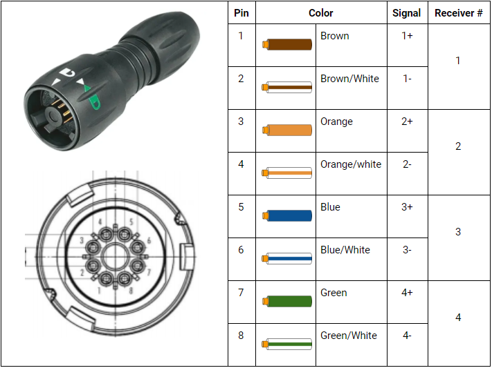
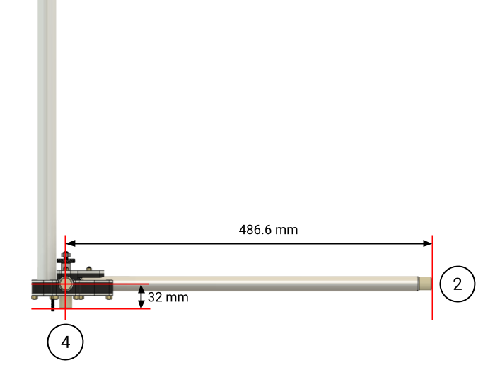

# Antenna

[Buy Antenna here!](https://waterlinked.com/product/antenna/)

## Description

The Antenna is a quick deployable analog hydro acoustic receiver compatible with the Underwater GPS G2 system. The Antenna is equipped with 4 Receiver-A1 with large dynamic range followed by advanced digital signal processing functionality when connected to the Underwater GPS G2 topside unit.

## Benefits

* Foldable to minimize space during travel (54 x 12.5 x 14.5 cm).

* Quick deployable to minimize setup time.

* Small baseline (98 x 53.5 cm) suitable for small boats and tanks/pools.

* Highly robust operation in areas with reflections (shallow water, around installations etc.)

* Includes C-Size RAM Mount fixtures for universal mounting capabilities.

## Wiring interface

The Antenna comes with 10 meters of cable. This is the maximum cable length available for the Antenna due to noise limitations on the analog signals.

The table below shows the pinning of the Antenna connector.

## Dimensions

Top view

Side view

