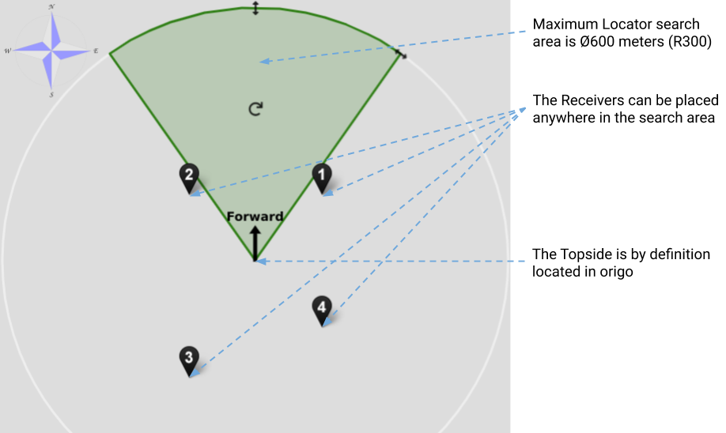

# Baseline

Select *Antenna* or *Receivers* in the tab at the top according to whether an [antenna](../../../antenna) or loose [receivers](../../../receiver-d1) are used.

## Antenna

The antenna can be placed anywhere up to 10m from the topside housing (limited by cable length). Go through the following. By the _antenna base_ is meant the joining point of the three prongs with the receivers at their ends.

|                     |                      |
| ------------------- | :------------------- |
| **Alignment**       | Ensure that the 'Forward' direction of the antenna as defined by a label on one of its prongs (see also the figure below) is aligned with the 'Forward' direction of the topside housing (indicated by a label on the lid).   If it is not possible to physically align them, in *Baseline -> Antenna configuration -> Advanced settings*, specify the clockwise angle in degrees from the forward axis of the topside to the forward axis of the antenna.   If this alignment is not carried out, the [global](../../reference-frames#global) position outputted by UGPS G2 will be incorrect.
| **Line-of-sight**   | Ensure that there will be line-of-sight between the antenna and locator.  |
| **Antenna depth**  | Ensure that the base of the antenna is at a depth of at least one metre (as indicated by a label upon the top folding joint of the pole of the antenna), to avoid acoustic disturbance.   The depth of the antenna base (relative to the sea surface) must be specified in *Baseline -> Antenna configuration -> Advanced settings -> Antenna depth*. If it is not, both the [acoustic](../../reference-frames#acoustic) and [global](../../reference-frames#global) positions may be incorrect.  |
| **Antenna stability** | Secure the antenna tightly to the vessel using the provided Ram Mount. |

  

Further points of note:

* **Limit search area** : a better position will likely be obtained if the search area is restricted as far as possible in the graphical configuration pane at *Baseline -> Antenna configuration*.
* **Directivity** : the antenna and locators are omnidirectional, that is, signal strength should be good in all directions

## Receivers

Loose receivers can be placed anywhere up to 100m from the topside housing. Go through the following, and configure the placement of the receivers in the graphical pane at *Baseline -> Receiver and range configuration* so that their positions relative to the origin and their depths are correct.

|                     |                      |
| ------------------- | :------------------- |
| **Line-of-sight**   | Ensure that all the receivers will have line-of-sight to the locator. |
| **Separation** | Ensure that the receivers are not too close, and are not all in a line. A grid of 2x2 metres should typically be sufficient for good performance, but experiment with different configurations if you experience sub-optimal performance.  |
| **Depth**  | Place the receivers at a depth of at least a metre, to avoid acoustic disturbance.     |
| **Stability** | Consider adding some weight to the receiver cables just above the receivers.  |

Further points of note:

* **Limit search area** : a better position will likely be obtained if the search area is restricted as far as possible in the graphical configuration pane at *Baseline -> Antenna configuration*.   

    

      
    

     

* **Directivity** : the receivers and locators are omnidirectional, that is, signal strength should be good in all directions

The figure below indicates a typical loose receiver configuration when the topside unit is upon a boat. The receivers hang from the side of the boat. The origin of the the acoustic frame is in this case a point on the topside unit.

  

