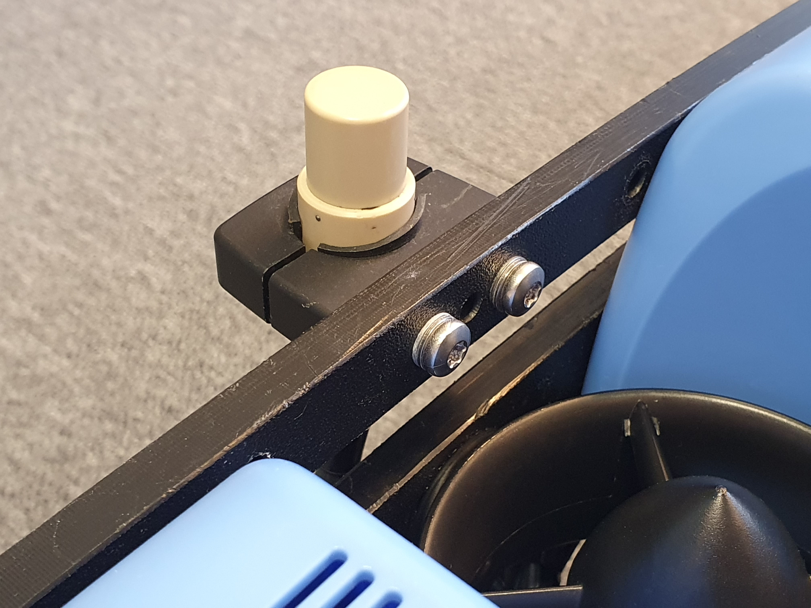

# Installation of Locator-A1 on BlueROV2 with integration kit

This guide describes the hardware modifications to the ROV, FXTI and UGPS Topside in order to integrate the [Locator-A1](../../locators/locator-a1). To summarize, two main changes are performed: A spare twisted wire pair in the tether is used to connect the Locator-A1 and the UGPS Topside. Secondly, the UGPS Topside is connected directly to the communication between ROV and topside computer.

## Required parts and tools

[BlueROV2 Integration Kit](https://waterlinked.com/shop/underwater-gps-g2-bluerov2-integration-kit-103) from Water Linked. It contains the following parts (purpose in parentheses)

1.  Mechanical parts (for physical mounting of Locator-A1)
    * Locator-A1 mounting bracket, [printable 3D model](https://waterlinked.com/web/content/7664?download=true)
    * rubber pad
    * 2 M4x35 Socket head cap screws
    * 2 M4 Lock Nuts
2.  A female-to-female jumper wire, white/green (for locator connection in FXTI)
3.  A Binder-connector-pigtail-assembly, with [Binder 770 Series NNC Miniature Cable Connector](https://octopart.com/99-0771-002-08-binder-39031370), pins 1/2: white/blue, pin 7/8: white/brown (analog connection and Powerline connection in FXTI)
4.  Powerline communication (PLC) module [LX200V30](https://www.rakwireless.com/en-us/products/plc-boards-and-modules/lx200v30-plc-homeplug-av-module) (for Powerline communication in UGPS Topside)
5.  30cm Cat5e cable (for Powerline connection in UGPS Topside)
6.  8 m cable with [Binder 770 connectors](https://www.binder-connector.com/en/products/miniature-circular-connectors/bayonet-ncc-1/99-0771-002-08-bayonet-ncc-male-cable-connector-contacts-8-60-80-mm-unshielded-solder-ip67) "deck extension cable"(for analog connection and Powerline communication between FXTI and UGPS Topside))

!!! Info "Powerline communication (PLC)"
	The term Powerline communication describes the technology with which the FXTI and the BlueROV communicate with each other over the Fanthom-X Tether. It is usually used to transmit data and communication signals, e. g. Ethernet, on existing electrical wiring in buildings, allowing for data transfer and communication without the need for dedicated network cables.

* [Locator-A1](https://waterlinked.com/shop/underwater-gps-g2-locator-a1-120)

* [UGPS G2 Topside](https://waterlinked.com/shop/underwater-gps-g2-topside-133)

* Your [BlueROV2](https://bluerobotics.com/store/rov/bluerov2/bluerov2/)

* [M10-6.5mm-LC WetLink Penetrator](https://bluerobotics.com/store/cables-connectors/penetrators/wlp-vp/) from Blue Robotics

* [WetLink Bulkhead Wrench M10](https://bluerobotics.com/store/cables-connectors/tools/wlp-bulkhead-wrench/?attribute_bulkhead-size=M10) from Blue Robotics

* [Hex Key Set](https://bluerobotics.com/store/watertight-enclosures/enclosure-tools-supplies/tool-hex-set-r1/) e.g. from Blue Robotics, especially 2, 2.5 and 3 mm hex key

* [Silicone Grease](https://bluerobotics.com/store/watertight-enclosures/enclosure-tools-supplies/molykote/)
* Isopropyl Alcohol Wipe
* 7 mm spanner or wrench
* 4 mm drill bit
* [Cable jacket stripper](https://bluerobotics.com/store/cables-connectors/tools/cable-jacket-stripper/), a utility knife, or a sharp blade
* Cutting pliers
* A soldering iron and solder
* Heat shrink tube

**Optional components/tools**

* [WetLink Penetrator Assembly Block](https://bluerobotics.com/store/cables-connectors/tools/wlp-assembly-block-r1-rp/) and a vice to secure it
* [WetLink Penetrator Plug Wrench 14mm](https://bluerobotics.com/store/cables-connectors/tools/wlp-plug-wrench-vp/?attribute_plug-hex-size=14+mm+Hex+%28for+5.5+mm%2C+6.5+mm%2C+7.5+mm%2C+8.5+mm+penetrators%29) and a A 1/4 inch (6.3mm) square drive ratchet or torque wrench
* Large flat head screwdriver
* Bottle of threadlocker
* Hot air gun

## Modifications to the BlueROV2

The Locator-A1 will use one of the spare cable penetrators in the back of the BlueROV2 and will connect to the spare green and white twisted pair in the tether. The locator is attached with a mounting bracket included in the BlueROV2 Integration Kit.

### Open the electronics enclosure

To open the electronics enclosure, you will need the following parts and tools:

* 2.5 mm hex key
* Large flat head screwdriver (optional)

To ensure your ROV is completely powered off, please remove the battery completely from the 3” enclosure and place to the side.

Unscrew the M3x16 screws that mount the electronics enclosure to the ROV cradle (in the front and in the back). The number of screws depends on the model version of your ROV.

Remove the Vent Plug from the Vent Penetrator Bolt on the electronics enclosure. Remove the 4″ tube and forward dome assembly from the rear end cap by sliding it forward. A large flat head screw driver can help to do that.

### Replace blank penetrator with Locator-A1 penetrator

To remove a blank penetrator and install the cable of the Locator-A1 into the end cap, you will need the following parts and tools:

* [Locator-A1](https://waterlinked.com/shop/underwater-gps-g2-locator-a1-120)
* [M10-6.5mm-LC WetLink Penetrator](https://bluerobotics.com/store/cables-connectors/penetrators/wlp-vp/) from Blue Robotics
* [Silicone Grease](https://bluerobotics.com/store/watertight-enclosures/enclosure-tools-supplies/molykote/)
* Isopropyl Alcohol Wipe
* [WetLink Bulkhead Wrench M10](https://bluerobotics.com/store/cables-connectors/tools/wlp-bulkhead-wrench/?attribute_bulkhead-size=M10) from Blue Robotics
* [WetLink Penetrator Assembly Block](https://bluerobotics.com/store/cables-connectors/tools/wlp-assembly-block-r1-rp/) and a vice to secure it (optional)
* [WetLink Penetrator Plug Wrench 14mm](https://bluerobotics.com/store/cables-connectors/tools/wlp-plug-wrench-vp/?attribute_plug-hex-size=14+mm+Hex+%28for+5.5+mm%2C+6.5+mm%2C+7.5+mm%2C+8.5+mm+penetrators%29) and a A 1/4 inch (6.3mm) square drive ratchet or torque wrench (optional)
* [Cable jacket stripper](https://bluerobotics.com/store/cables-connectors/tools/cable-jacket-stripper/), a utility knife, or a sharp blade
* Cutting pliers

Remove the blank penetrator as pictured from the 4” End Cap with the penetrator bulkhead wrench.

Cut the cable of the Locator-A1 to the correct length with cutting pliers considering that about 15 cm of cable are needed inside the enclosure. For the recommended mounting position you need a length of around 70 cm. Double check that this is sufficient for your mounting position.

Remove 10 cm of the cable jacket using a cable jacket stripper, a utility knife, or a sharp blade. Cut off everything except the twisted pair of wires using cutting pliers.

Follow the Blue Robotics [WetLink Penetrator Assembly Guide](https://bluerobotics.com/learn/wetlink-penetrator-installation-guide/) and install the WetLink penetrator onto the Locator-A1 cable.

Wipe the exterior surface of the electronics enclosure end cap clean with an isopropyl alcohol wipe, and make sure it is free of any particles in the areas where the penetrator O-ring will sit.

Remove the O-ring from the bag and apply silicone grease to it.

Install the O-ring onto the WetLink penetrator.

Install the WetLink penetrator with the Locator-A1 cable onto the end cap in the hole you previously removed a blank penetrator from. Tighten to finger tight, then use the bulkhead wrench to tighten it an additional ~1/16 of a turn. If you can’t loosen it with your fingers, it is tight enough.

### Connect Locator-A1 wires to ROV tether

One pair of twisted wires from the Locator-A1 (green/white) must be connected to a spare twisted pair on the BlueROV2 tether. To solder the wires together you will need:

* A soldering iron and solder
* A utility knife, or a sharp blade
* Heat shrink tube
* Hot air gun (optional)

!!! Note
    Alternatively to soldering you can use your favourite headers to establish an electrical connection.

Remove 5mm wire insulation on both the tether wires and the locator wires with a knife.

Put heat shrink tube onto the wires before soldering.

Connect the Locator-A1 wires (green/white) to a spare twisted pair of the tether (recommended: green/white) by soldering.

Pull the the heat shrink tube over the solder-connection and shrink it with a hot air gun or alternatively with your soldering iron turned to low.

### Reassemble BlueROV2 Electronics Enclosure

To reassemble your BlueROV2 Electronics Enclosure, you will need the following parts and tools:

* M3x16 screws that were placed off to the side during disassembly (number depends on your BlueROV version)
* [Silicone Grease](https://bluerobotics.com/store/watertight-enclosures/enclosure-tools-supplies/molykote/)
* 2.5 mm hex key

Reinstall 4” Watertight Enclosure onto ROV with the following steps:

Apply silicone grease to the two radial O-rings on the O-Ring Flange (4” Series) that is attached to the Electronics Tray. Then slide the Watertight Enclosure (4” Series) with installed Dome End Cap over the electronics tray and the O-Ring Flange (4” Series) while trying to align the clips for the screws in the front and back.

Mount the Electronics Enclosure to the frame using the M3x16 screws so that the dome is on the same side as the front center panels (the center panels without the 3 large holes). Install the M3x16 screws through the clips and into the Enclosure Cradle (4” Series). It is easier to install these screws if the clips are not fully tightened until all screws are through the clips and threading into the Enclosure Cradle (4” Series). This allows clips to rotate so you can find the threaded hole in the Enclosure Cradle (4” Series) easily.

### Mount the Locator-A1 to the BlueROV2 frame

To mount the Locator-A1 to the BlueROV2 frame, you will need the following parts and tools:

* Locator-A1 mounting bracket (included in the BlueROV2 Integration Kit)
* rubber pad (included in the BlueROV2 Integration Kit)
* 2 M4x35 Socket head cap screws (included in the BlueROV2 Integration Kit)
* 2 M4 Lock Nuts (included in the BlueROV2 Integration Kit)
* 3 mm hex key
* 7 mm spanner or wrench
* 4 mm drill bit

Route the locator cable to one side of the ROV.

The below picture illustrates the recommended mounting position. Your mounting bracket might look differently.

Find an appropriate spot to attach the Locator-A1 mounting bracket to the frame of the BlueROV2. Drill out two holes spaced 49.25 mm apart using a 4 mm drill bit.

Wrap the locator in the rubber pad before inserting into the mounting bracket.

Attach the Locator-A1 to the Locator-A1 mounting bracket, and secure the bracket to the BlueROV2 using the M4x35 Socket head cap screws and lock nuts.

## Modifications to the UGPS Topside

In the following steps you will upgrade your UGPS G2 Topside with Powerline communication (PLC) capabilities to communicate directly with the BlueROV2. In order to do that, you will need the following parts and tools:

* [UGPS G2 Topside](https://waterlinked.com/shop/underwater-gps-g2-topside-133)
* Ethernet cable (included in the BlueROV2 Integration Kit)
* Powerline communication (PLC) module [LX200V30](https://www.rakwireless.com/en-us/products/plc-boards-and-modules/lx200v30-plc-homeplug-av-module) (included in the BlueROV2 Integration Kit)
* Soldering iron

### Connect Ethernet cable

Locate the ethernet ports on the Interface Electronics board and the Master Electronics board.

Connect the included Ethernet cable to the two ports.

### Install the PLC module

In this step the the Powerline communication (PLC) module is installed on the Interface Electronics board.

??? Info "What do the LEDs on the PLC module mean?"
	

	| LED | Definition | Function |
	|-----|------------|----------|
	| 1   | Power      | Lights when the PLC module has power |
	| 2   | Ethernet   | Flashes when there is data flow from Master Electronics |
	| 3   | PLC        | Lights when a link is established with FXTI or BlueROV2 |

Locate the socket for the PLC module on the Interface board.

Press the PLC module into the socket, making sure that the press-fit standoffs latch into the holes in the Interface Electronics board.

### Modify Interface Electronics

!!! Note
	This step is only necessary for Underwater GPS G2 bought *before* June 2021. For units produced after June 2021, this step is not necessary.

!!! Warning
	Skipping this step leaves a regulated 12V power source from the Underwater GPS on the PLC lines (pins 1 (GND) and 2 (12V) on the Locator bulkhead connector). Connecting non-isolated equipment to the PLC lines may damage the Underwater GPS or any external equipment.

!!! Note
	Locator-D1 cannot be used unless the resistors are soldered back on to the Interface Electronics.

<!-- TODO customer to add replacement parts ?-->

The Interface Electronics board in the Underwater GPS housing comes with resistors R2 and R3 which put GND on pin 1 and 12V on pin 2 of the bulkhead connector with the label “Locator”. The configuration of the FXTI, BlueROV2 and the Underwater GPS G2 *are* affected by leaving these resistors on the board, so they *must* be removed for normal operation.

Remove the resistors with a soldering iron.

## Modifications to the FXTI

In this step the FXTI will be modified to firstly connect the analog signal of the Locator-A1 between the ROV tether and the UGPS Topside. Secondly the UGPS Topside is connected to the existing communication wires between the BlueROV and the FXTI electronics (Powerline Ethernet signals). A high level diagram of how this will look is shown below.

In order to make these connections, you will need the following parts and tools:

* Binder-connector-pigtail-assembly (included in the BlueROV2 Integration Kit)
* A female-to-female jumper wire, white/green (included in the BlueROV2 Integration Kit)
* 2 mm hex key

Unscrew the connector panel from the FXTI with the hex key and remove one of the black plastic plugs from one of the auxiliary ports.

Thread the Binder-connector-pigtail-assembly into the open port and secure in place with the included bulkhead nut.

Connect the green and white twisted pair of the tether connector to the brown and brown/white pair on the new Binder-connector-pigtail-assembly with the included female-to-female jumper wire.

Connect the blue and white twisted pair of the Binder-connector-pigtail-assembly to the FXTI Tether Connection PCB, matching the orientation of the pre-installed blue and white wire connections.

Reassemble the FXTI box.

## Establish a network connection between UGPS Topside, BlueROV2 and topside computer

Now that all hardware modifications are done, you will connect UGPS Topside, FXTI/BlueROV2 and topside computer and test the network connection.

* Power up the BlueROV. Connect the BlueROV with the tether to the FXTI. Connect the FXTI with the USB-cable to the computer.

!!! Note "FXTI USB port"
	Your topside computer may have a USB port which permits higher than default (which is 500mA) current. Such ports are typically marked with a lightning or battery symbol. Also USB 3.0 ports (blue plastic) provide higher current. If available, we recommend use of one of these for plugging in the FXTI, as this can improve performance.

* Set your topside computer to have a static IP address of 192.168.2.1 with subnet mask 255.255.255.0. The BlueROV2 typically has IP address 192.168.2.2, so you probably already have this set up. Make sure your firewall allows QGroundControl to communicate with the network. Look at the [Network Setup steps at Blue Robotics](https://bluerobotics.com/learn/bluerov2-software-setup/#network-setup) if you need more details.

* Set the [IP switch](../../network-settings/#ethernet) inside the UGPS Topside unit to `192.168.2.94` (the down position). This equips the G2 topside unit with the static IP address 192.168.2.94.

* Connect the Binder-connector named "Locator" at the UGPS Topside with the newly installed Binder-connector at the FXTI using the deck extension cable, which came with the BlueROV integration kit. (Power up the UGPS Topside)[https://waterlinked.github.io/underwater-gps/power-supply/]. It is on when the power button is lit.

You should now be able to access both the BlueROV by typing `192.168.2.2` in your browser address line and UGPS Topside by typing `192.168.2.94`. Both have to be turned on.

## Final steps of integration

When you have successfully established a network connection and can access both BlueROV2 and UGPS Topside, you can continue with [Final steps of integration independent of Locator](bluerov-integration.md#final-steps-of-integration-independent-of-locator).