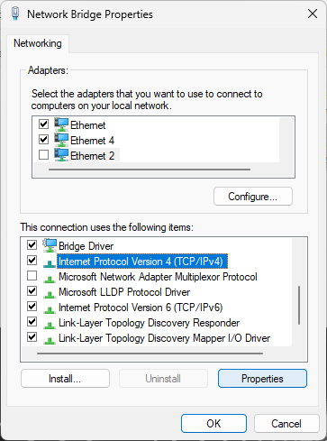

# Installation of Locator-U1 on BlueROV2

This guide contains instructions for installation of the [Locator-U1](../../locators/locator-u1) to a BlueROV2. The first part describes the mechanical installation and the second part describes how to establish a network bridge between UGPS Topside and FXTI/BlueROV2.

## Mount the Locator-U1 to the BlueROV2 frame

Attach the Locator-U1 to the BlueROV2 for example by using zip ties. Make sure the Locator-U1 has free line-of-sight towards the antenna/receivers near the surface.

See the [general Locator-U instructions](../locators/locator-u1.md) for daily operation (charging, powering on, etc.).

## Establish a network connection between UGPS Topside, BlueROV2 and topside computer

<!-- does ugps topside always have external ethernet port? -->
In this guide it is described how to establish a network connection between UGPS Topside, FXTI/BlueROV2 and topside computer without hardware modifications to the UGPS Topside. This is opposed to the method used with the BlueROV integration kit for Locator-A1. To put it short, the connection between the three devices is established with a network bridge and a static IP address of 192.168.2.1 (subnet mask 255.255.255.0) for your computer.

1. Set the [IP switch](../../network-settings/#ethernet) inside the UGPS G2 topside unit to `192.168.2.94` (the down position). This equips the G2 topside unit with the static IP address 192.168.2.94.

2. [Connect power](https://waterlinked.github.io/underwater-gps/power-supply/) to the UGPS Topside and switch on the power, resulting in the power switch lighting up.

3. Connect an Ethernet cable to the UGPS Topside.

4. Connect the BlueROV with the tether to the FXTI and plug the USB-cable into the FXTI. Power up the BlueROV.

5. Establish a network bridge on your computer. This depends on your operating system:

??? Info "Windows"

	To create a network bridge between the FXTI/BlueROV2 and the UGPS Topside in Microsoft Windows, open the "Control Panel" by searching for it in the startmenu. Open "Network and Internet".

	

	Open "Network and Sharing Center".

	

	Click "Change adapter settings" in the sidebar.

	

	The "Network Connections" window (see below) shows all network adapters connected to your computer. The number and name of adapters shown depends on your computer hardware.

	

	Now identify the adapter for the FXTI by connecting its USB-cable to the computer. Unplug and replug the cable if you plugged it in before. A new adapter should show up, which is called "Realtek USB..." in the gray subtitle. Note its name. In the example there are two adapters in the picture below starting with "Realtek USB", one additional by a docking station. So you can identify the correct adapter best by comparing which one is new, it is "Ethernet 4".

	Do the same with the UGPS Topside, connect its ethernet cable to the computer. In the shown example the red cross for adapter "Ethernet" vanishes, indicating that a device is connected to the network adapter. So in the shown example "Ethernet" is the UGPS Topside and "Ethernet 4" is the FXTI.

	

	Create a network bridge between the two adapters identified in the previous step by selecting both with the help of the "Ctrl"-key. Then right click on one of them and select "Bridge Connections".

	

	A new adapter called "Network Bridge" should appear. Right-click on it and select "Properties".

	

	In the window "Network Bridge Properties" scroll through the lower list and select "Internet Protocol Version 4 (TCP/IPv4)". Click on the button "Properties".

	

	In the window "Internet Protocol Version 4 (TCP/IPv4)" select "Use the following IP address" and type in the IP address "192.168.2.1" and Subnet mask "255.255.255.0". Click OK to close the window and also close the previous window "Network Bridge Properties" with OK.

	

	You should now be able to access both the BlueROV by typing 192.168.2.2 in your browser address line and UGPS Topside by typing 192.168.2.94. Both have to be turned on.

	

	If you do not need the network bridge anymore, you can delete it by navigating to "Change Adapter Settings" as described above, right-clicking on the Network Bridge and then clicking "Disable".

??? Info "Linux"
	On Linux the [instructions](https://wiki.archlinux.org/title/Network_bridge) at the Arch Linux wiki, in the section 'With iproute2', should work.

	!!! Note
		Unfortunately these instructions do not work for Ubuntu.

??? Info "MacOS"
	On a Mac, the [instructions](https://wiki.archlinux.org/title/Network_bridge) at the Arch Linux wiki should work if the package `iproute2mac` is installed, providing an analogue of the `ip` package. Alternatively, essentially the same procedure can be followed using `ifconfig`, which should be available on a Mac, instead of `ip`.

## Final steps of integration

When you have successfully established a network bridge and can access both BlueROV2 and UGPS Topside, you can continue with [Final steps of integration independent of Locator](bluerov-integration.md#final-steps-of-integration-independent-of-locator).