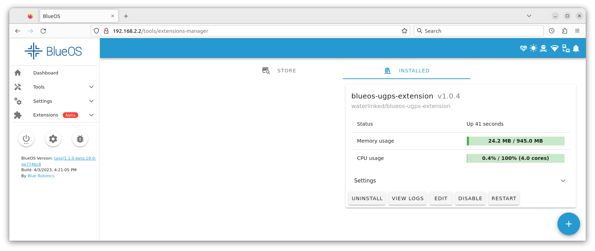

# Overview BlueROV2 integration

The Water Linked Underwater GPS G2 (from now UGPS) system can be integrated with a BlueROV2 from Blue Robotics in different ways, depending upon the choice of locator.

## Most common integration methods

* We recommend you to use the [Locator-A1](../../locators/locator-a1) together with the [BlueROV2 Integration Kit](https://waterlinked.com/shop/underwater-gps-g2-bluerov2-integration-kit-103) when integrating the UGPS system with the BlueROV2. The integration steps are described in [BlueROV2 Integration Locator-A1](bluerov-integration-a1.md). Hardware modification must be carried out on the ROV, FXTI and UGPS Topside which serve two purposes: Firstly, a spare twisted wire pair in the tether is used to connect the Locator-A1 to the UGPS Topside. Secondly, the UGPS Topside is modified to connect directly to the communication between ROV and topside computer. The advantage of integrating using this method is that there is no additional topside computer configuration required, which can be challenging with different operating systems (i.e. Linux, iOS). <!--Once installed, the Locator-A1 requires least user interaction, e. g. no accumulator needs to be charged.-->

* If you wish to avoid carrying out hardware changes to the ROV, as they are required to integrate the A1-Locator, then we recommend you to use the [Locator-U1](../../locators/locator-u1). The locator can simply be attached to the BlueROV2 in any convenient way. However some configuration steps in the topside computer are required to establish a network bridge, so the position calculated by the UGPS Topside is available in QGroundControl. These steps are described in [BlueROV2 Integration Locator-U1](bluerov-integration-u1.md). Be aware that setting up a network bridge in operating systems other than Windows can be challenging.

## Alternative integration methods
* If you wish to use a [Locator-A1](../../locators/locator-a1), however you wish to avoid purchasing the full integration kit then this can be done. The Locator-A1 must be installed on the ROV and connected to the G2 Topside and then it is necessary to set-up a network bridge. The steps in these sections are relevant
    * [Modifications to the BlueROV2](bluerov-integration-a1.md#modifications-to-the-bluerov2)
    * [Modifications to the FXTI](bluerov-integration-a1.md#modifications-to-the-fxti) with the deviation that the blue/white twisted pair between Tether Connection PCB and Binder-connector-pigtail-assembly does not need to be connected.
    * [Establish a network connection with a network bridge](bluerov-integration-u1.md#establish-a-network-connection-between-ugps-topside-bluerov2-and-topside-computer)
    * [Final steps](#final-steps-of-integration-independent-of-locator)

* If you wish to use the [Locator-U1](../../locators/locator-u1), however you wish to avoid the complication in setting up a network bridge, it is possible to integrate by using the [BlueROV2 Integration Kit](https://waterlinked.com/shop/underwater-gps-g2-bluerov2-integration-kit-103). The steps in these sections are relevant
    * [Mount the Locator-U1 to the BlueROV2 frame](bluerov-integration-u1.md#mount-the-locator-u1-to-the-bluerov2-frame)
    * [Modifications to the UGPS Topside](bluerov-integration-a1.md#modifications-to-the-ugps-topside)
    * [Modifications to the FXTI](bluerov-integration-a1.md#modifications-to-the-fxti) with the deviation that the green/white twisted pair between tether and Binder-connector-pigtail-assembly does not need to be connected.
    * [Establish a network connection with powerline communication](bluerov-integration-a1.md#establish-a-network-connection-between-ugps-topside-bluerov2-and-topside-computer)
    * [Final steps](#final-steps-of-integration-independent-of-locator)

* If using a [Locator-D1](../../locators/locator-d1), use the D1's cable and attach the D1 locator to the BlueROV2 in any convenient way. No further hardware integration is then required. As with the Locator-U1,
    * [Establish a network connection with a network bridge](bluerov-integration-u1.md#establish-a-network-connection-between-ugps-topside-bluerov2-and-topside-computer)
    * and follow the [final steps](#final-steps-of-integration-independent-of-locator)

## Final steps of integration independent of Locator

If you have successfully installed a Locator with one of the above linked guides, these are the final configuration steps to be performed.

### BlueROV Software Update and UGPS extension

??? Info "Your BlueROV2 runs BlueOS"

	This section is for the R4 version of the BlueROV2 that uses the [Navigator Flight Controller](https://bluerobotics.com/store/comm-control-power/control/navigator/) or ROVs that have been upgraded to [BlueOS](https://docs.bluerobotics.com/ardusub-zola/software/onboard/) software.

	!!! Info

		If you have an older R1, R2, or R3 version of the BlueROV2 that uses a Pixhawk autopilot and you want to upgrade to using BlueOS, you can either carry out a software upgrade only [(described here)](https://docs.bluerobotics.com/ardusub-zola/software/onboard/BlueOS-1.1/installation/) or upgrade the hardware from Pixhawk to Navigator flight controller and the software [(described here)](https://bluerobotics.com/learn/navigator-retrofit-guide/).

	The Water Linked UGPS system requires an extension in BlueOS to be able to communicate with the autopilot (Pixhawk or Navigator flight controller). BlueOS has to be updated to **BlueOS 1.1.0** or newer to assure that extensions are supported sufficiently. Follow the Update Software section of the [BlueROV Software Setup guide](https://bluerobotics.com/learn/bluerov2-software-setup/#update-software)

	To enable the UGPS extension navigate to "Extensions", that should show up in the side bar after the above described BlueOS update.

	Click on the "Water Linked UGPS" extension.

	

	In the pop-up make sure the latest version (> 1.0.4) is selected and click "Install".

	

	The extension should show up in the "Installed" tab.

	

??? Info "Your BlueROV2 runs Ardusub Companion"

	This section is for older R1, R2, or R3 versions of the BlueROV2 that use a Pixhawk autopilot and [Companion](https://www.ardusub.com/introduction/required-software/companion-computer-software.html) software.

	To work properly, the Water Linked UGPS system requires ArduSub Companion image version **0.0.21** or newer and the most recent stable release of QGroundControl for your operating system. If your Companion image is out of date, please follow the BlueROV2 Software [Update procedures](https://bluerobotics.com/learn/bluerov2-software-setup-r3-and-older/#update-software).

	!!! Note
		No special extension for the UGPS system is necessary in Companion OS. It is natively supported.

### Checking UGPS to autopilot connection on land

If you open QGroundControl you should be able to establish a connection to the ROV as before UGPS integration. Furthermore you should be able to see messages of type `GPS_INPUT` in the MAVLink Inspector (click on Q-logo, then Analyze Tools, then MAVLink Inspector in sidebar). This is the MAVLink message that is provided by the UGPS BlueROV Extension to the autopilot (Pixhawk or Navigator flight controller). For detailed information about the extension see the [BlueOS Extension for UGPS GitHub page](https://github.com/waterlinked/blueos-ugps-extension).

## Daily operation

This section will help you if a UGPS system was already integrated with the BlueROV2 and you want to use and not also install it.

1. Follow the instructions of the UGPS Quickstart-Guide from the Water Linked Documentation for [antenna](../quickstart.md#antenna) or [loose receivers](../quickstart.md#loose-receivers) deployment.
2. Connect BlueROV2, FXTI, topside computer and UGPS Topside and assure the network connection is working:
    * For the Locator-A1, follow [this section](bluerov-integration-a1.md#establish-a-network-connection-between-ugps-topside-bluerov2-and-topside-computer)
    * For the Locator-U1, follow [this section](bluerov-integration-u1.md#establish-a-network-connection-between-ugps-topside-bluerov2-and-topside-computer). In addition, note the channel setting in the Locator-U1 and close the lid to power it up.
3. Follow the steps of the [Quickstart-Guide](../quickstart.md#select-locator-and-channel-in-the-gui) from the Water Linked Documentation for:
    * Selecting the locator in the GUI
	  * Configuring antenna/receiver placement and search range.
	  * Setting of heading.
4. Start QGroundControl and verify the connection to the BlueROV2. Even if the ROV can not have a location fix above water it should now receive data from the UGPS system. See [Checking UGPS to autopilot connection on land](#checking-ugps-to-autopilot-connection-on-land)
5. Dive the BlueROV2 so the Locator is submerged a few centimeters below the surface.

If everything is operating correctly, you should now find a ROV position on the map in QGroundControl. The ROV position is indicated by a BlueROV2 image. The position of the surface vessel or Water Linked UGPS Topside housing is indicated by a red arrow or Q-symbol depending of QGroundControl version. The small ‘H’ icon indicates the ‘home position’, the location of the ROV’s first GPS lock.

!!! Note "UGPS Topside position"
	The UGPS topside position is not shown reliably on all systems. It is sent as NMEA to UDP port 14401, so check your configuration in QGroundControl.

## Troubleshooting

### 'No External Depth' error in UGPS Topside GUI, or QGroundControl connection issues (for Ardusub Companion)

This almost certainly means that the network between the UGPS G2 topside and the BlueROV2 has not been successfully established. First carry out the following steps:

1. Ensure you are using the latest versions of ArduSub Companion and QGroundControl: [Update Software](https://bluerobotics.com/learn/bluerov2-software-setup/#update-software)
2. In the Companion Web Interface, go to the [MAVProxy](http://www.ardusub.com/operators-manual/companion-web.html#mavproxy) page: [http://192.168.2.2:2770/mavproxy](http://192.168.2.2:2770/mavproxy)
3. Click on the “Restore Default Options” button.
4. Power cycle the BlueROV2.
5. Check the PLC LED (3) on the [PLC module](bluerov-integration-a1.md#install-the-plc-module) (see box "What do the LEDs on the PLC module mean?")

If the issue persists, if you are using the FXTI approach to the networking, you may wish to try the network bridge approach, as the FTXI sometimes fails to handle the connections satisfactorily. In addition, double-check that you did not skip the [Modifications to the FXTI](bluerov-integration-a1.md#modifications-to-the-fxti).

If none of this solves the problem, you are very welcome to [contact us](https://waterlinked.com/support), and we will be happy to support you.

### Connection to BlueROV2 lost when connecting Underwater GPS to FXTI

The current draw by the FXTI can exceed 500 mA when connecting the Underwater GPS to the PLC network. This can then cause the FXTI to become unstable if it's connected to a standard USB 2.0 port on the computer since USB 2.0 allows for a maximum of 500 mA current draw. There are two known solutions:

1. Connect the USB cable of the FXTI to a USB 3.0/3.1 compatible USB-A port. USB 3.0/3.1 allows for a maximum of 900 mA current draw. A USB 3.0/3.1 compatible USB-A port should be recognized by its blue plastic parts.

2. Add a separate power source to the [Fathom-X](https://bluerobotics.com/store/comm-control-power/tether-interface/fathom-x-tether-interface-board-set-copy/) inside the FXTI. The Fathom-X board has screw terminals marked BATT which can attach to a 7-28V DC power source.

## Water Linked software updates

Keep the Water Linked software [up to date](../../sw-update). The GUI should notify when an update is available, but the current version can also be checked at [192.168.2.94/#/about](http://192.168.2.94/#/about).