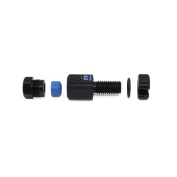
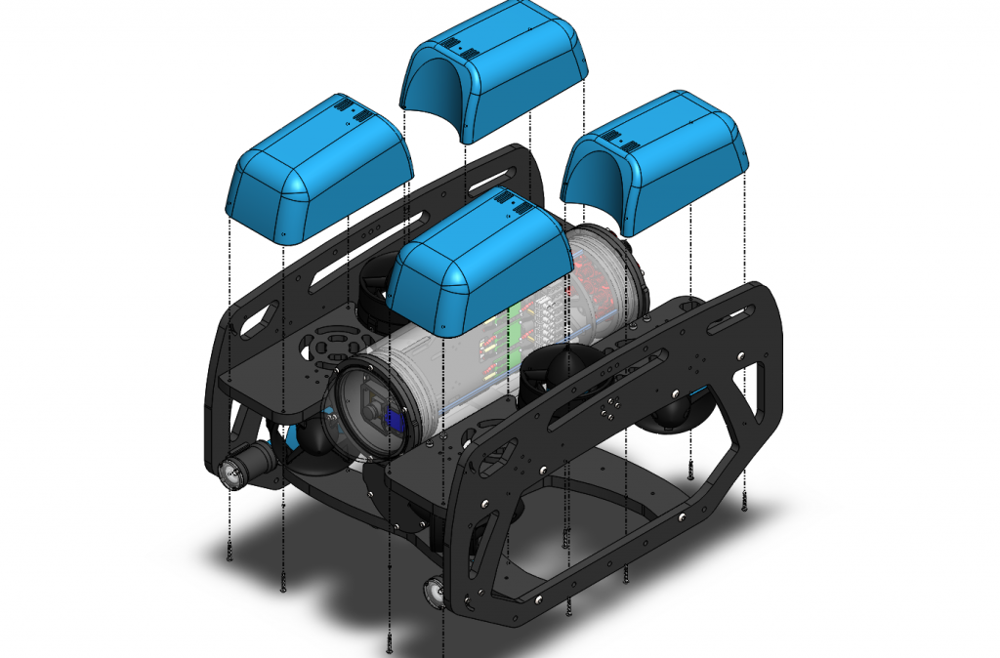
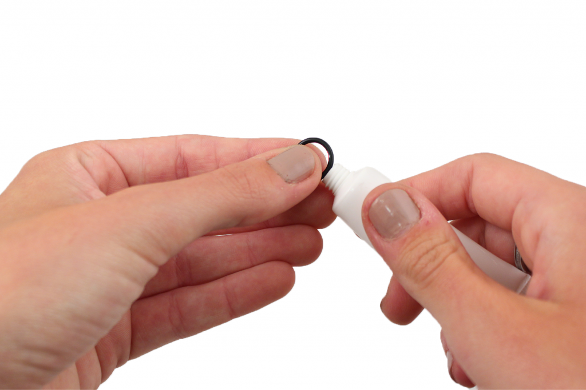
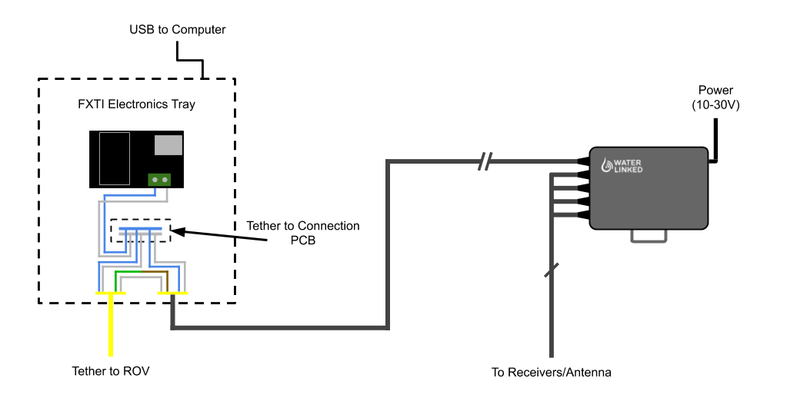
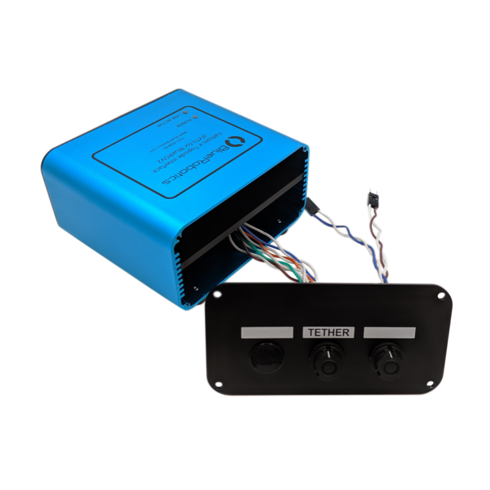
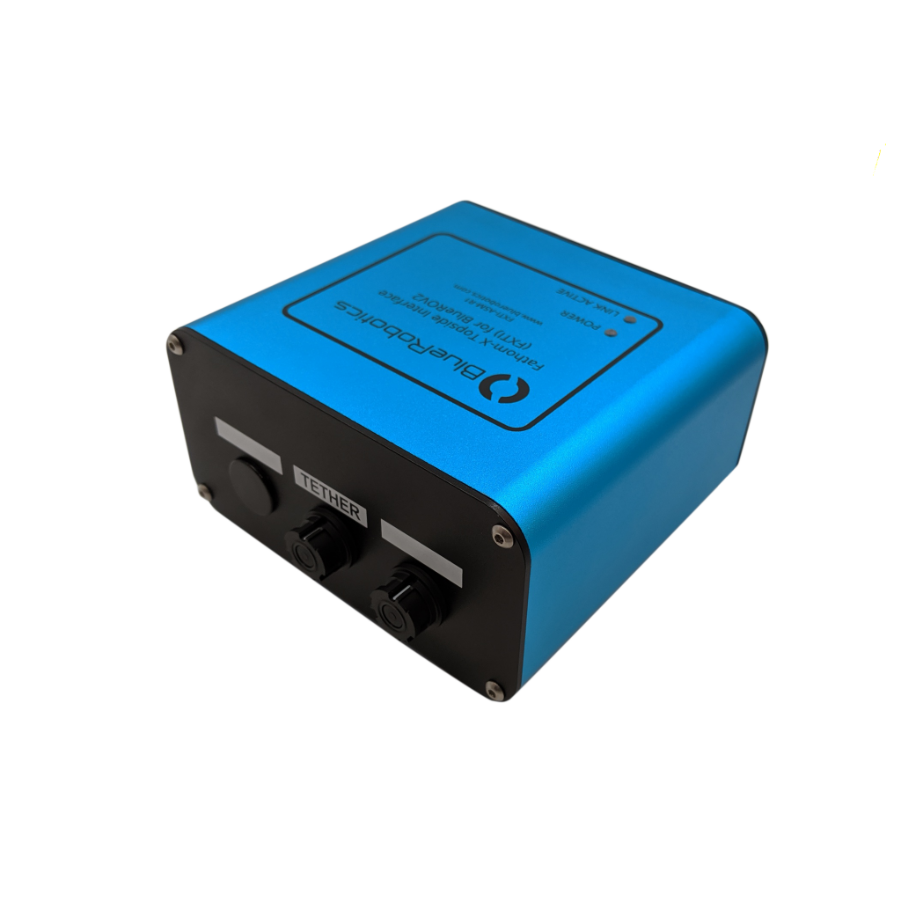
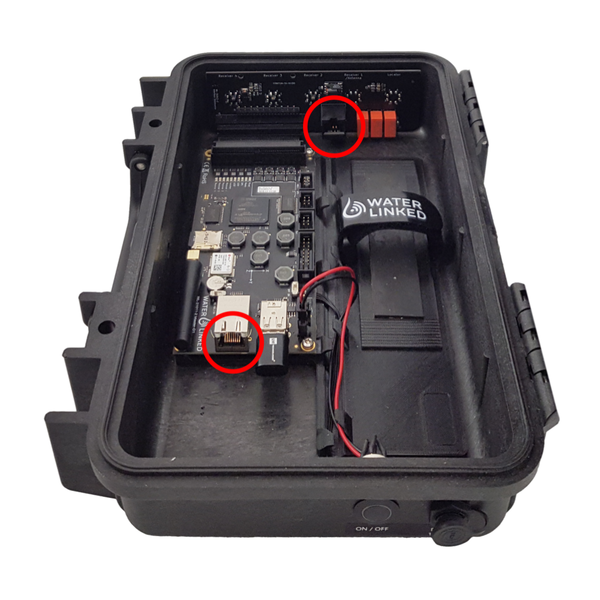
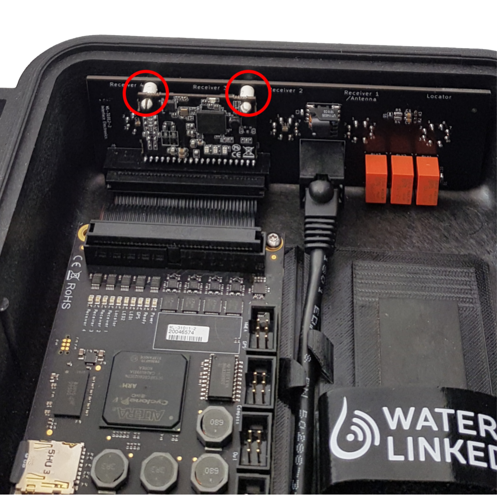
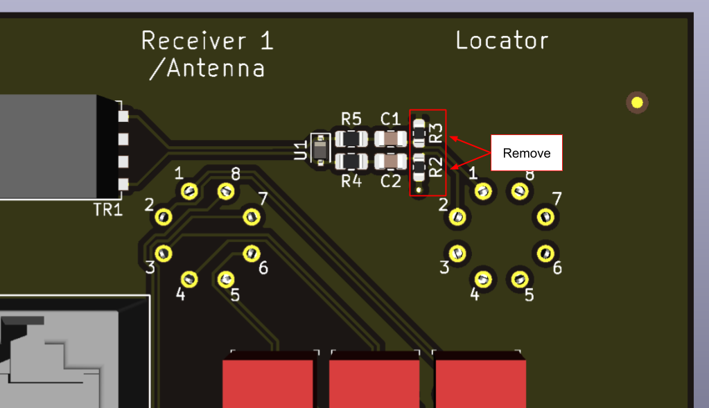

## Introduction

The Water Linked Underwater GPS G2 system can be integrated with a BlueROV2 in several different ways, depending upon the choice of locator.

* If using a [Locator-U1](../../locators/locator-u1), the locator can simply be attached to the BlueROV2 in any convenient way. No further hardware integration is required. [Establish a network connection](#via-a-topside-computer) via a topside computer between the UGPS G2 topside unit and the BlueROV2, and follow the [final steps](#final-steps) of the guide below to complete the integration with ArduSub/QGroundControl.
* If using a [Locator-A1](../../locators/locator-a1), follow the guide below. There are two main configuration options. One connects the FXTI to the UGPS G2 topside unit by means of a connection interface built into the UGPS G2 topside unit with power-line communication (PLC) capabilities, making use of the [BlueROV2 Integration Kit](https://waterlinked.com/product/bluerov2-integration-kit/).

    The other connects the UGPS G2 topside to the BlueROV2 via your topside computer, by means of a network bridge. The Homeplug card of the BlueROV2 integration kit is not needed in this case, and you will likely wish to purchase directly a couple of simple [parts](#a1-integration-without-bluerov2-integration-kit) which are made use of in the guide.

* If using a [Locator-D1](../../locators/locator-d1), the simplest option is to use the D1's cable, and attach the D1 locator to the BlueROV2 in any convenient way. No further hardware integration is then required. As with the Locator-U1, [establish a network connection](#via-a-topside-computer) via a topside computer between the UGPS G2 topside unit and the BlueROV2, and follow the [final steps](#final-steps) of the guide below to complete the integration with ArduSub/QGroundControl.

    To use the ROV tether rather than the D1's cable, use the same guide as for the Locator-A1 with certain [modifications](#integration-via-the-bluerov2-tether-when-using-a-d1-locator). This is an option if the ROV has a fiber-optic tether (the Locator-A1 cannot be used in that case).

## Integration when using the Locator-A1

### Required components and tools

 [BlueROV2 Integration Kit](https://waterlinked.com/shop/underwater-gps-g2-bluerov2-integration-kit-103) from WaterLinked. It contains the following parts (purpose in parentheses)

1.  Mechanical parts (for physical mounting of Locator-A1)
    * Locator-A1 mounting bracket, [printable 3D model](https://www.waterlinked.com/hubfs/Product_Assets/Locator_A1/A1_Locator_Bracket.zip)
    * rubber pad
    * 2 M4x35 Socket head cap screws
    * 2 M4 Lock Nuts
2.  A female-to-female jumper wire, white/green (for analog connection in FXTI)
3.  A [Binder 770 Series NNC Miniature Cable Connector](https://octopart.com/99-0771-002-08-binder-39031370), pins 7 and 8. white/brown+white/blue (analog connection and powerline connection in FXTI)
4.  Powerline communication (PLC) module [LX200V30](https://www.rakwireless.com/en-us/products/plc-boards-and-modules/lx200v30-plc-homeplug-av-module) (for powerline connection in UGPS Topside)
5.  30cm Cat5e cable (for powerline connection in UGPS Topside)
6.  8 m cable with [Binder 770 connectors](https://www.binder-connector.com/en/products/miniature-circular-connectors/bayonet-ncc-1/99-0771-002-08-bayonet-ncc-male-cable-connector-contacts-8-60-80-mm-unshielded-solder-ip67) (for analog connection and powerline connection between FXTI and UGPS Topside))

* Your [BlueROV2](https://bluerobotics.com/store/rov/bluerov2/bluerov2/)

* [M10-6.5mm-LC WetLink Penetrator](https://bluerobotics.com/store/cables-connectors/penetrators/wlp-vp/) from Blue Robotics

* [Bulkhead Wrench](https://bluerobotics.com/store/cables-connectors/tools/wlp-bulkhead-wrench/?attribute_bulkhead-size=M10) for WetLink Penetrators from BlueRobotics

* [Hex Key Set](https://bluerobotics.com/store/watertight-enclosures/enclosure-tools-supplies/tool-hex-set-r1/) e.g. from Blue Robotics

* \#1 Phillips head screwdriver

**Optional components/tools**

* Bottle of threadlocker
* Soldering iron

### Install the Locator-A1 on the BlueROV2

You will need to install the Locator-A1 on the BlueROV2 using components from the BlueROV2 Integration Kit. The locator will use one of the spare cable penetrations in the back of the BlueROV2 and will connect to the spare green and white twisted pair in the tether.

!!! Note
	The Locator-A1 requires a mounting bracket to attach it to the BlueROV2. The bracket is included in the [BlueROV2 Integration Kit](https://waterlinked.com/product/bluerov2-integration-kit/), but we also have a 3D model of a suitable [mounting bracket](https://www.waterlinked.com/hubfs/Product_Assets/Locator_A1/A1_Locator_Bracket.zip) which you can 3D print as is, or modify to your needs. Alternatively you can simply attach the Locator-A1 to the BlueROV2 using zip ties. Just make sure the Locator-A1 has free line-of-sight towards the antenna/receivers near the surface.

#### Remove a blank penetrator

To remove a blank penetrator from your BlueROV2, you will need the following tools:

* 2.5 mm hex driver
* \#1 Phillips head screwdriver
* Penetrator wrench

To ensure your ROV is completely powered off, please remove the battery completely from the 3” enclosure and place to the side.

Remove the fairings and buoyancy blocks by removing the self-tapping screws that hold the fairings to the frame.

Remove the 4” electronics enclosure from the ROV by removing the M3x16 screws that mount the enclosure to the ROV cradle.

Remove the Vent Plug from the Vent Penetrator Bolt on the electronics enclosure. Remove the 4″ tube and forward dome assembly from the rear end cap.

Remove the blank penetrator as pictured from the 4” End Cap with the penetrator wrench that came with the BlueROV2 kit.

#### Install Locator-A1 penetrator

To install the Locator-A1 into the end cap, you will need the following parts and tools:

* [Locator-A1](https://waterlinked.com/product/locator-a1/)
* [M10-6.5mm-LC WetLink Penetrator](https://bluerobotics.com/store/cables-connectors/penetrators/wlp-vp/) from Blue Robotics
* [Silicone Grease](https://bluerobotics.com/store/watertight-enclosures/enclosure-tools-supplies/molykote/)
* Isopropyl Alcohol Wipe
* [Bulkhead Wrench](https://bluerobotics.com/store/cables-connectors/tools/wlp-bulkhead-wrench/?attribute_bulkhead-size=M10) from BlueRobotics
* [Cable jacket stripper](https://bluerobotics.com/store/cables-connectors/tools/cable-jacket-stripper/), a utility knife, or a sharp blade
* Cutting pliers

One pair of twisted wires from the Locator-A1 must be connected to a spare twisted pair on the BlueROV2 tether. This can be done permanently by soldering or splicing, or by crimping on an appropriate header. For the latter you'll need:

* [1x3-Pin 0.1" (2.54mm) Crimp Connector Housing](https://www.pololu.com/product/1902)
* 2x [Male Crimp Pins for 0.1" Housings](https://www.pololu.com/product/1931)
* [Crimping tool](https://www.pololu.com/product/1928)

Remove 10 cm of the cable jacket using a cable jacket stripper, a utility knife, or a sharp blade. Cut off everything except the blue and white/blue twisted pair using cutting pliers.

Follow the BlueRobotics [WetLink Penetrator Assembly Guide](https://bluerobotics.com/learn/wetlink-penetrator-installation-guide/) and install the WetLink penetrator onto the Locator-A1 cable.

If you intend to add a 1x3 connector, do so now.

Wipe the exterior surface of the electronics enclosure end cap clean with isopropyl alcohol or isopropyl alcohol wipes, and make sure it is free of any particles in the areas where the penetrator O-ring will sit.

Remove the O-ring from the bag and apply silicone grease to it.

Install the O-ring onto the WetLink penetrator.

Install the Locator-A1 with the WetLink penetrator onto the end cap in the hole you previously removed a blank penetrator from. Tighten to finger tight, then use the bulkhead wrench to tighten it an additional ~1/16 of a turn. If you can’t loosen it with your fingers, it is tight enough.

Connect the Locator-A1 wires (green/white) to a spare twisted pair of the tether (green/white).

#### Reassemble BlueROV2 electronics enclosure

To reassemble your BlueROV2 Electronics Enclosure, you will need the following parts and tools:

* 4 x M3x16 screws that were placed off to the side during disassembly
* [Silicone Grease](https://bluerobotics.com/store/watertight-enclosures/enclosure-tools-supplies/molykote/)
* 2.5 mm hex driver

Reinstall 4” Watertight Enclosure onto ROV with the following steps:

Apply silicone grease to the two radial O-rings on the O-Ring Flange (4” Series) that is attached to the Electronics Tray then install the Watertight Enclosure (4” Series) with installed Dome End Cap to the O-Ring Flange (4” Series).

Mount the Electronics Enclosure to the frame using the M3x16 screws so that the dome is on the same side as the front center panels (the center panels without the 3 large holes). Install the M3x16 screws through the clips and into the Enclosure Cradle (4” Series). It is easier to install these screws if the clips are not fully tightened until all screws are through the clips and threading into the Enclosure Cradle (4” Series). This allows clips to rotate so you can find the threaded hole in the Enclosure Cradle (4” Series) easily.

#### Mount the Locator-A1 to the BlueROV2 frame

To mount the Locator-A1 to the BlueROV2 frame, you will need the following parts and tools:

* Locator-A1 mounting bracket (included in the [BlueROV2 Integration Kit](https://waterlinked.com/product/bluerov2-integration-kit/), [printable 3D model available](https://www.waterlinked.com/hubfs/Product_Assets/Locator_A1/A1_Locator_Bracket.zip))
* 2 x M4x35 Socket head cap screws (included in the [BlueROV2 Integration Kit](https://waterlinked.com/product/bluerov2-integration-kit/)
* 2x M4 Lock Nuts (included in the [BlueROV2 Integration Kit](https://waterlinked.com/product/bluerov2-integration-kit/)
* 3 mm hex driver
* 7 mm spanner or wrench
* 4 mm drill bit

Route the locator to one side of the ROV.

Find an appropriate spot to attach the Locator-A1 mounting bracket to the frame of the BlueROV2. Drill out two holes spaced 49.25 mm apart using a 4 mm drill bit.

Attach the Locator-A1 to the Locator-A1 mounting bracket, and secure the bracket to the BlueROV2 using the M4x35 Socket head cap screws and lock nuts.

### Connect the UGPS G2 topside to the A1 locator via the BlueROV2 tether

This will be achieved by making certain modifications to the FXTI. A high level diagram of how this will look is shown below.

To enable connection between the UGPS G2 topside unit and the FXTI, you will need the following parts and tools:

* Bulkhead wire assembly (included in the BlueROV2 Integration Kit)
* Brown/white jumper lead (included in the BlueROV2 Integration Kit)
* 2 mm hex driver

Unscrew the bulkhead panel from the FXTI and remove one of the black plastic plugs from one of the auxiliary ports.

Thread the FXTI Binder pigtail wire assembly into the open port and secure in place with the included bulkhead nut.

Connect the green and white twisted pair to the brown and brown/white pair on the Binder connector pigtail with the included female-to-female jumper wire.

You now need to choose one of the two options for [establishing a network connection](#establish-a-network-connection-between-the-ugps-g2-topside-unit-and-the-bluerov2) between the UGPS G2 topside and the BlueROV2: [via a topside computer](#via-a-topside-computer) or [by modifications to the FXTI](#by-fxti-modifications).

If you choose the option of connecting the UGPS G2 to your topside computer, i.e. the option not involving the FXTI, the modifications to the FXTI are now complete, and you may re-assemble the FXTI box.

!!! Note
	Your topside computer may have a USB port which permits higher than default (which is 500mA) current. Such ports are typically marked with a lightning symbol. If available, we recommend use of one of these for plugging in the FXTI, as this can improve performance

### Establish a network connection between the UGPS G2 topside unit and the BlueROV2

There are two options:

* Connect the UGPS G2 topside to your topside computer, and via the latter to the BlueROV2, by means of a network bridge.

* Connect the FXTI to the UGPS G2 topside unit by means of a connection interface built into the UGPS G2 topside unit with power-line communication (PLC) capabilities, making use of the [BlueROV2 Integration Kit](https://waterlinked.com/product/bluerov2-integration-kit/).

#### Via a topside computer

Proceed as follows.

1. Set the [IP switch](../../network-settings/#ethernet) inside the UGPS G2 topside unit to `192.168.2.94` (the down position). This equips the G2 topside unit with the static IP address 192.168.2.94.
2. Set your topside computer to have a static IP address of the form 192.168.2.xxx (that is to say, in the 192.168.2.0/24 subnet, with mask 255.255.255.0). The BlueROV2 typically has IP address 192.168.2.2, so you probably already have this set up.
3. Connect the UGPS G2 topside unit to your topside computer using an ethernet cable.
4. Create a [network bridge](#creating-a-network-bridge) between the ethernet interface on your computer through which the UGPS G2 topside unit is connected and the ethernet interface through which the FXTI is connected.

!!! Note
      Modifications of the interface electronics board are not necessary when taking this approach. Nor is installation of the PLC module.

##### Creating a network bridge

On Linux, for more or less any distribution, the [instructions](https://wiki.archlinux.org/title/Network_bridge) at the Arch Linux wiki, in the section 'With iproute2', should provide a quick and simple way to do this.

On a Mac, the same instructions should work if the package `iproute2mac` is installed, proving an analogue of the `ip` package. Alternatively, essentially the same procedure can be followed using `ifconfig`, which should be available on a Mac, instead of `ip`.

On Windows, the bridge can be set up via the [network connections GUI](https://www.windowscentral.com/how-set-and-manage-network-bridge-connection-windows-10).

#### By FXTI modifications

##### Connect ethernet cable

To connect ethernet from the Interface Electronics board to the Master Electronics board, you will need the following part:

* Ethernet cable (included in the BlueROV2 Integration Kit)

Locate the ethernet ports on the Interface Electronics board and the Master Electronics board.

Connect the included ethernet cable to the two ports.

##### Install the PLC module

To install the PLC module to the Interface Electronics board, you will need the following part:

* LX200V30 PLC Homeplug module with press-fit standoffs (included in the BlueROV2 Integration Kit).

| LED | Definition | Function |
|-----|------------|----------|
| 1   | Power      | Lights when the Homeplug has power |
| 2   | Ethernet   | Flashes when there is data flow from Master Electronics |
| 3   | PLC        | Lights when a link is established with FXTI or BlueROV2 |

Locate the socket for the Homeplug module on the Interface board.

Press the PLC module into the socket, making sure that the press-fit standoffs latch into the holes in the Interface Electronics board.

##### Modify Interface Electronics

!!! Note
	This step is only necessary for Underwater GPS G2 bought *before* June 2021. For units produced after June 2021, this step is not necessary.

!!! Warning
	Skipping this step leaves a regulated 12V power source from the Underwater GPS on the PLC lines (pins 1 (GND) and 2 (12V) on the Locator bulkhead). Connecting non-isolated equipment to the PLC lines may damage the Underwater GPS or any external equipment.

The Interface Electronics board in the Underwater GPS housing comes with resistors R2 and R3 which put GND on pin 1 and 12V on pin 2 of the bulkhead connector with the label “Locator”. The configuration of the FXTI, BlueROV2 and the Underwater GPS G2 *are* affected by leaving these resistors on the board, so they *must* be removed for normal operation. The resistors can be removed using a soldering iron. Note that Locator-D1 cannot be used unless the resistors are soldered back on to the Interface Electronics.

##### Modify FXTI

Continuing the instructions for [connecting the UGPS G2 topside to the A1 locator](#connect-the-ugps-g2-topside-to-the-a1-locator-via-the-bluerov2-tether), connect the blue and white wire pair into the FXTI Tether Connection PCB, matching the orientation of the pre-installed blue and white wire connections.

Reassemble the FXTI box.

### ArduSub Companion software update

To work properly, the Water Linked UGPS system requires ArduSub Companion image version **0.0.21** or newer and the most recent stable release of QGroundControl for your operating system. If your Companion image is out of date, please follow the BlueROV2 Software [Update procedures](http://docs.bluerobotics.com/brov2/software-setup/#update-software).

### Final steps

1. Configure the Water Linked system with a static IP address of 192.168.2.94 according to the [Network section](../network-settings.md) of the Water Linked Documentation.

2. Connect the topside computer to the FXTI and configure the topside computer to static IP address 192.168.2.1.

3. Connect the BlueROV2 to the FXTI and power the BlueROV2 normally.

4. Start QGroundControl and verify the connection to the BlueROV2.

5. Connect the FXTI to the Water Linked Box using the deck extension cable from the BlueROV2 Integration Kit.

6. Follow the [Quickstart](../quickstart.md) from the Water Linked Documentation for:
	* Powering of the Water Linked topside box.
	* Setting of heading.
	* Deployment of the antenna/receivers.
	* Configuration of the UGPS system: of the [antenna/receivers](../../gui/receivers), and of the [locator and topside box](../../gui/settings).

7. Dive the BlueROV2 so the Locator is submerged a few inches below the surface.

If everything is operating correctly, you should now find an ROV position on the map in QGroundControl. The ROV position is indicated by a BlueROV2 image. The position of the surface vessel or Water Linked Master Electronics housing is indicated by a red arrow. The small ‘H’ icon indicates the ‘home position’, the location of the ROV’s first GPS lock.

### Troubleshooting

#### 'No External Depth' error, or QGroundControl connection issues

This almost certainly means that the network between the UGPS G2 topside and the BlueROV2 has not been successfully established. First carry out the following steps:

1. Ensure you are using the latest versions of ArduSub Companion and QGroundControl: [Update Software](https://bluerobotics.com/learn/bluerov2-software-setup/#update-software)
2. In the Companion Web Interface, go to the [MAVProxy](http://www.ardusub.com/operators-manual/companion-web.html#mavproxy) page: [http://192.168.2.2:2770/mavproxy](http://192.168.2.2:2770/mavproxy)
3. Click on the “Restore Default Options” button.
4. Power cycle the BlueROV2.
5. Check that the PLC LED (3) on the Homeplug board.

If the issue persists, if you are using the FXTI approach to the networking, you may wish to try the network bridge approach, as the FTXI sometimes fails to handle the connections satisfactorily. In addition, double-check that you did not skip the [interface electronics board modification](#modify-interface-electronics).

If none of this solves the problem, you are very welcome to [contact us](https://support.waterlinked.com/en/knowledge), and we will be happy to support you.

#### Connection to BlueROV2 lost when connecting Underwater GPS to FXTI

The current draw by the FXTI can exceed 500 mA when connecting the Underwater GPS to the PLC network. This can then cause the FXTI to become unstable if it's connected to a standard USB 2.0 port on the computer since USB 2.0 allows for a maximum of 500 mA current draw. There are two know solutions:

1. Connect the USB lead of the FXTI to a USB 3.0/3.1 compatible USB-A port. USB 3.0/3.1 allows for a maximum of 900 mA current draw. A USB 3.0/3.1 compatible USB-A port should be recognized by its blue plastic parts.

2. Add a separate power source to the [Fathom-X](https://bluerobotics.com/store/comm-control-power/tether-interface/fathom-x-tether-interface-board-set-copy/) inside the FXTI. The Fathom-X board has screw terminals marked BATT which can attach to a 7-28V DC power source.

### Water Linked software updates

Keep the Water Linked software [up to date](../../sw-update). The GUI should notify when an update is available, but the current version can also be checked at [192.168.2.94/#/about](http://192.168.2.94/#/about).

## Integration via the BlueROV2 tether when using a Locator-D1

There are two options. The one we recommend is to proceed exactly as when [connecting the UGPS G2 topside to the A1 locator using the BlueROV2 tether](#connect-the-ugps-g2-topside-to-the-a1-locator-via-the-bluerov2-tether), except that where the green and white twisted pair of the A1 locator is referred to, instead both the orange and white twisted pair and the blue and white twisted pair of the [D1 locator](../../locators/locator-d1) should be used. Thus one will require three twisted pairs in the BlueROV2 tether if the [FXTI approach](#by-fxti-modifications) to establishing a network connection between the UGPS G2 topside and the BlueROV2 is chosen, and two if the [network bridge](#via-a-topside-computer) approach is chosen. If taking this approach, 'A1 locator' should be selected in the [GUI locator config](../../gui/settings/#locator-setup), not 'D1 locator' ('D1 locator' should only be selected if using the D1 locator with its supplied cable).

If using a fiber-optic tether, the A1 locator cannot be used, as the electrical signal sent via the green and white pair can not easily be converted to an optical one. However, the D1 locator can be used via the integration of the previous paragraph, with the addition that a converter from RS-422 to optical should be used in between the UGPS G2 topside box and the tether, and a converter from optical to RS-422 should be used at the BlueROV2 end between the tether and the Locator-D1.

!!! Note
	Precise measurement of time-of-flight is crucial to the accuracy of the UGPS G2 positioning. Thus it is important that any latency from making conversions between RS-422 and optical signals is negligible. Latency of the order of nano-seconds, which many converters have, is fine.

The other option is the same, except all twisted pairs of the D1 locator are used in the integration, rather than only two of them. This will enable the UGPS G2 topside to receive the depth of the locator from its depth sensor, and the [step](#establish-a-network-connection-between-the-ugps-g2-topside-unit-and-the-bluerov2) of establishing a network connection between the UGPS G2 topside unit and the BlueROV2 can be skipped. This requires three twisted pairs in the BlueROV2 tether. In this case, 'D1 locator' should be selected in the [GUI locator config](../../gui/settings/#locator-setup). This option is again possible in the case of a fiber-optic tether by means of conversion to and from RS-422 and optical.

!!! Note
        The depth sensor of the D1 locator is likely to be less accurate than the BlueROV2's depth sensor, and it is for this reason that we recommend to integrate the D1 locator as if it were an A1 locator, in the manner described in the first paragraph of this section.

## Locator-A1 integration without BlueROV2 integration kit

In this case, the [network bridge](#via-a-topside-computer) approach must be chosen. Otherwise, the guide for the A1 locator above can be followed as-is, except that in order to [connect](#connect-the-ugps-g2-topside-to-the-a1-locator-via-the-bluerov2-tether) the UGPS G2 topside unit to the FXTI for sending of signals to the A1 locator, one will likely need a couple of parts. Specifically, in the guide, the following are used:

1. A [Binder 770 Series NNC Miniature Cable Connector](https://octopart.com/99-0771-002-08-binder-39031370) (pins 7 and 8) to connect to the 'Locator' bulkhead of the UGPS G2 topside unit.
2. A female-to-female jumper wire (in the FXTI modifications).

For signal integrity, use a Cat5e cable between the UGPS G2 topside and the FXTI.
