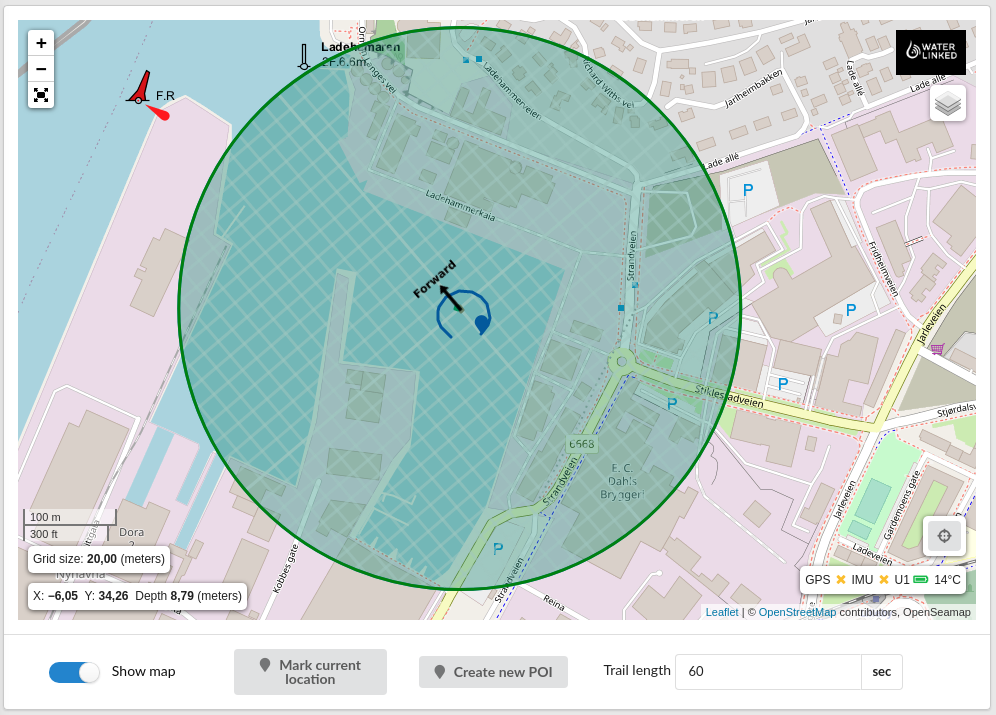

# Introduction

## Underwater GPS G2

[Buy Underwater GPS G2 here!](https://waterlinked.com/product/underwater-gps-g2/)

 

[Underwater GPS G2](https://www.waterlinked.com/underwater-gps) is a new and improved version of the Explorer Kit. It provides an even more robust and reliable acoustic positioning system with a range of up to 300m (R300 edition). The purpose of the system is to give a live GPS position of ROVs, divers and other moving objects below the water surface.

 

The Underwater GPS G2 system is based upon Short Baseline (SBL) acoustic positioning. A locator ([U1](../locators/locator-u1), [A1](../locators/locator-a1), or [D1](../locators/locator-d1)) is attached to the device to be positioned. It functions as a beacon, sending out acoustic signals. Near the surface, either an [antenna](antenna) containing four receivers is lowered into the water, or four loose [receivers](../receiver-d1) are lowered into the water. These listen for the beacon signals.

Time-of-flight from the locator to each of the four receivers is used in an innovative algorithm to calculate the position of the locator relative to the UGPS G2 topside unit. We refer to as the _acoustic position_. The UGPS G2 system obtains a _global position_ by combining this acoustic position with the global GPS coordinates of the topside unit. This may be provided by the topside unit's in-built GPS antenna, or, for greater precision, passed in externally by means of the UGPS G2 [API](../integration/api). This API provides output of both the acoustic and global positions calculated by the UGPS G2 system, as well as comprehensive programmatic configuration of the system.

Compared to USBL systems, the UGPS G2 system has the advantage of working well in challenging environments, for example shallow water, or reflective environments such as near ship hulls, in fish cages, near harbour installations, inside water tanks, etc. One of our [FAQs](https://support.waterlinked.com/en/knowledge/why-choose-ugps-g2-over-a-usbl-system) elaborates further on this.

## Features

* Range up to 300m (R300 version only)
* Quick deployment using an [antenna](antenna.md)
* WiFi connectivity
* Integrated global GPS antenna
* Interface supporting [BlueROV2 hardware integration](../integration/bluerov-integration)
* Simple and quick updating of firmware/software

## Kit content

* 1 x Underwater GPS Topside housing with Master-D1 and WiFi dongle
* 4 x Receiver-D1 with 10m cable / 1 x Antenna
* 1 x Locator U1/A1/D1
* 1 x 5m power cable

## Warnings

Please read the following carefully before the UGPS G2 system is installed and used for the first time.

|                     |                     |
| ------------------- |:------------------- |
| **Operation medium** | The Underwater GPS G2 system is designed only to work in water. It will not work if the locator and/or antenna/receivers are out of water. |
| **Max voltage** | The absolute maximum voltage rating of the equipment is 30V. Voltages above this will damage the electronics. |
| **Temperature** | Make sure the system does not overheat. Avoid placing it in direct sunlight over extended periods of time. |
| **Salt water** | The contents of the topside housing will corrode and/or short if in contact with salt water. Keep the housing lid closed when in the field to avoid salt water getting inside. |
| **Force** | Avoid using excessive force on connectors, screws and other parts of the system, as this can lead to mechanical failure. |

## Discussion

If you have questions, you are very welcome to contact our [customer support](https://support.waterlinked.com/en/knowledge), where we will be happy to help you.

## Datasheet

[Datasheet](https://www.waterlinked.com/hubfs/Product_Assets/UGPS_G2/W-MK-21025-1_G2.pdf)
