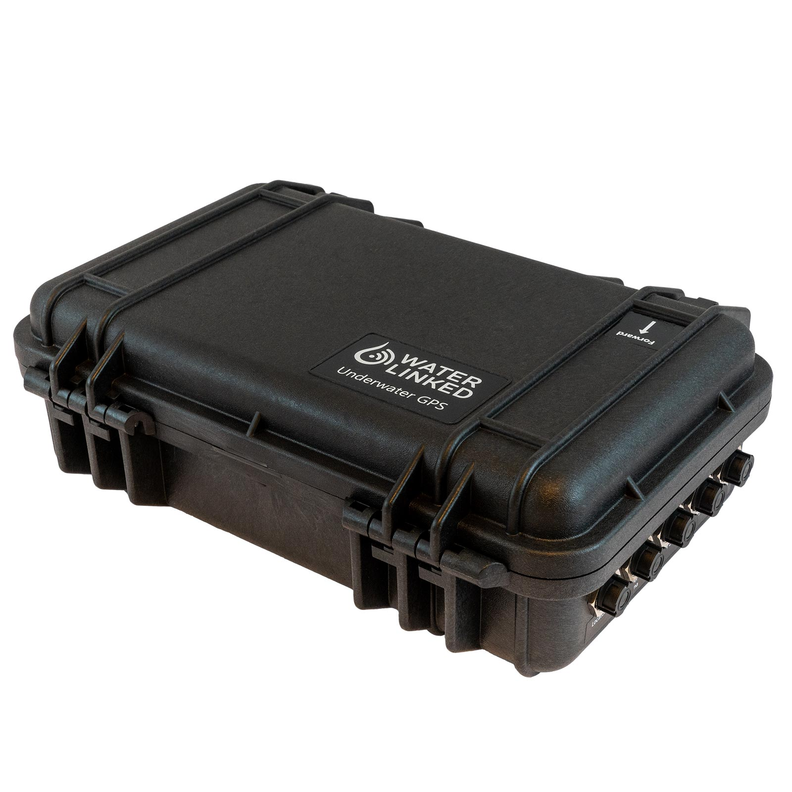

# Introduction

## Underwater GPS 

 

The Underwater GPS G2 is a new and improved version of the Explorer Kit. It provides an even more robust and reliable acoustic positioning system with a range of up to 300m (R300 edition). The purpose of the system is to give a live GPS position of ROVs, divers and other moving objects below the water surface.

 

The Underwater GPS system is based on Short Baseline (SBL) acoustic positioning. A Locator is attached to the device to be positioned and functions as a beacon that send out an acoustic pulse. Near the surface, four Receiver hydrophones are lowered into the water to receive the beacon signal. The Receivers listen for the pulse from the Locator. Time-of-arrival to each Receiver is used to calculate the Locator’s position. SBL systems, compared to USBL systems, have the advantage of working well in shallow water and acoustic reflective environments such as in fish cages, near harbor installations, close to ship hulls, inside water tanks etc.

Once the position is known relative to the Receivers, the global position can be found by adding that to the position obtained by a GPS receiver. The Underwater GPS system does that part internally so that it can provide the actual global position of the ROV as it's output.

## Revision features

* Increased range up to 300m (R300 version only)
* Support for quick deploy [Antenna](../antenna.md)
* WiFi connectivity
* 2 x IMUs
* Smaller topside housing
* Integrated GPS antenna
* New interface with BlueROV2 integration support

## Kit content

* 1 x Underwater GPS Topside housing with Master-D1 and WiFi dongle
* 4 x Receiver-D1 with 10m cable / 1 x Receiver antenna 
* 1 x Locator U1/A1/D1
* 1 x 5m power cable

## Quickstart

[Getting started with Waterlinked Underwater GPS](quickstart.md)

## Discussion

If you have more questions which is not answered on this website please go to our [forum](https://waterlinked.com/forums/forum/underwater-gps/) where we will be happy to answer you.

## Datasheet
[Datasheet](https://waterlinked.com/product/underwater-gps-g2/)