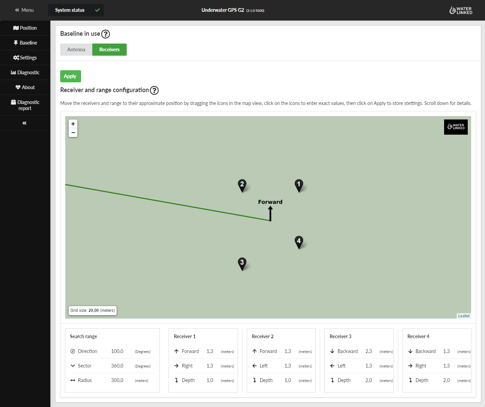
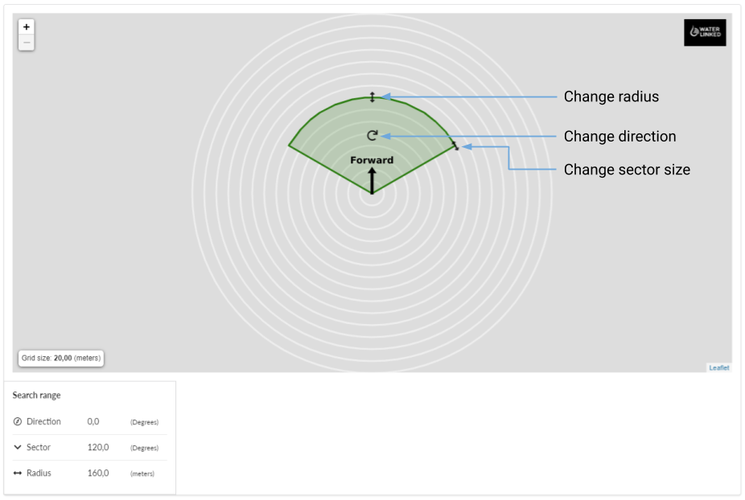

# Quickstart

## Intro

This is a guide on how to start using the Underwater GPS system. The steps are:

* Power the Topside unit
* Calibrate IMUs
* Deploying Antenna/Receivers
* Connect everything
* Select Locator and channel
* Configure Antenna/Receiver placement in GUI

## Power the topside unit

Start by connecting power to the topside unit. We do this first because we want the GPS Receiver to start receiving signals and achieve a lock while we setup the rest of the system. If you are using the Locator-U1, power it on now so it also have time to get GPS lock.

## Connect with Underwater GPS

Connect to the WiFi access point **UnderwaterGPS** on your PC/tablet/smartphone. Password for WiFi is **waterlinked**. Navigate to [http://192.168.7.1/](http://192.168.7.1/) in a web browser to access the Underwater GPS web GUI.

## Set heading

In the top bar of the GUI you will see a warning about missing heading. Click the link, click to zero the gyros and set compass heading to a reference heading (analog compass, compass app or boat compass).

!!! info
    Setting the heading replaces IMU calibration as of release 3.3.0.

## Select Locator and channel

Select the right Locator and choose which channal to listen on. This is configurated on the setting page of the web GUI. The Water Linked standard is to use channel 2. This is also the default channel for the Locator-U1.

!!! warning
    If you are using the Locator-A1 you need to provide depth information to the topside unit. Description on how to do this is found [here](integration/api.md#providing-depth-to-system-when-using-locator-a1).

## Deploying of Antenna/Receivers

### Antenna

Unfold the Antenna and lock the mast straight using the latches on the folding joints. Secure the three arms in place using the thumb screw. Place the Antenna in water at the desired location. Secure the Antenna using the RAM Mount components included with the Antenna.

!!! Tip
	If the RAM Mount components included with the Antenna does not accurately fit your needs, you can find many alternative RAM Mount Arms and Bases which will fit the C-Size [here](https://www.rammount.com/shop-all/popular-components/c-size).

### Receivers

Before starting to deploy the Receivers in the water, add a piece of tape on the Receiver cable on the desired depth to make setup easier. Place the Receivers in the water on the desired location and decide which number (1-4) each Receiver will have. This is important when connecting the Receivers to the topside unit.

!!! tip
    Adding lead weights just above the Receiver helps keep them stable when doing the positioning.

## Connect everything

When connecting the Receiver cables to the Topside unit remember the numbering you decided on and connect the connector to the accordingly port. If this is not correct the position will be completely wrong. Next you connect the Locator if you are using the A1 or D1.

## Configure Antenna/Receiver placement and seach range in GUI

After selecting the correct Locator, you need to provide the correct placement of the Antenna/Receivers to the GUI for the positioning to work correctly. This is done by either drag'n drop of each Receiver to the correct placement relative to the topside unit, or by entering the Receiver positions manually.

For the Antenna you can only enter the position manually under **Advanced settings**.

Limit the search area by changing the radius, direction and sector size.

!!! tip
    Reducing the search range helps to improve the performance of the system. It is recommended to limit this range if you are operating in a smaller area. This is especially important in tanks and pools.

You are now ready to explore the underwater world while knowing where you are!
