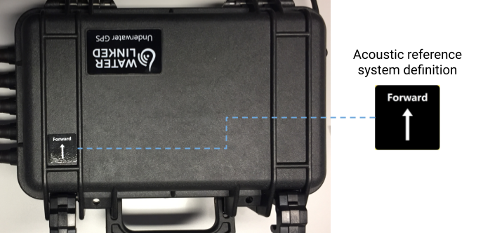

# Reference frames

UGPS G2 outputs positions in two reference frames: a _global_ frame and an _acoustic_ frame. The position in the global frame is obtained by combining the position in the acoustic frame with global GPS data and orientation data from the topside unit's built-in GPS antenna and IMU.

<svg xmlns="http://www.w3.org/2000/svg" viewBox="0 0 200 89">
  <defs>
    <marker id="leftarrowhead" markerWidth="6" markerHeight="6" refX="3" refY="3" orient="auto">
      <polygon points="6 0, 0 3, 6 6 " />
    </marker>
    <marker id="rightarrowhead" markerWidth="6" markerHeight="6" refX="3" refY="3" orient="auto">
      <polygon points="0 0, 6 3, 0 6 " />
    </marker>
  </defs>
  <text text-anchor="middle" x="30" y="5" font-size="0.3em">Global frame</text>
  <text text-anchor="middle" x="30" y="25" font-size="0.275em">North (° latitude)</text>
  <text text-anchor="left" x="60" y="55" font-size="0.275em" alignment-baseline="middle">East (° longitude)</text>
  <text text-anchor="middle" x="140" y="5" font-size="0.3em">Acoustic frame</text>
  <text text-anchor="middle" x="140" y="25" font-size="0.275em">x (Forward)</text>
  <text text-anchor="left" x="170" y="55" font-size="0.275em" alignment-baseline="middle">y</text>
  <line stroke="black" stroke-width="0.5" marker-start="url(#leftarrowhead)" x1="30" y1="30" x2="30" y2="80"/>
  <line stroke="black" stroke-width="0.5" marker-end="url(#rightarrowhead)" x1="5" y1="55" x2="55" y2="55"/>
  <line stroke="black" stroke-width="0.5" marker-start="url(#leftarrowhead)" x1="140" y1="30" x2="140" y2="80"/>
  <line stroke="black" stroke-width="0.5" marker-end="url(#rightarrowhead)" x1="115" y1="55" x2="165" y2="55"/>
</svg>

## Global frame

The positions of the global frame are in terms of latitude and longitude, as defined by the WGS 84 standard, and depth (relative to the sea surface). The _Map position_ tab in the _Position_ panel of the GUI plots the global frame position.

## Acoustic frame

The x-axis of the acoustic frame is defined by the 'Forward' direction of the topside housing (indicated by a label on the lid, as shown in the figure below). The y-axes and z-axes are defined to be 'east' and 'down' respectively in relation to this x-axis. The _Relative position_ tab in the _Position_ panel of the GUI plots the acoustic frame position.

The z-coordinate of the acoustic frame is always depth relative to the sea surface (not, say, relative to the antenna base, if using an antenna).  

 

The default origin is a point on the topside housing, but can be taken to be anywhere: it is entirely defined by the positioning of the antenna/receivers with respect to it. If using an antenna, it may help intuitively to take the origin to be the base of the antenna, which can be achieved by setting both *Distance to topside housing* fields to 0 under *Baseline -> Antenna configuration -> Advanced settings*.

!!! Note
    The axes of the acoustic frame in the first version of UGPS, the [Explorer Kit](../../explorer-kit/quickstart), were slightly different: it was the y-axis which was aligned with the forward direction of the topside housing, and the x-axis which was to the 'east' of this.
